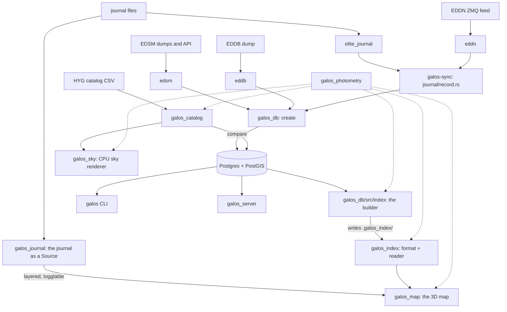

# Architecture

A map of the workspace: what each crate is for, which way the data runs, and
where the seams are. It is a map and not a manual — the arguments live in the
module headers, and this says which one to open.

Two datasets meet here. Elite's own, arriving as events and kept in Postgres,
authoritative and always growing. And the sky as it is measured from Earth,
read from published star catalogs. They meet at three quantities — a position,
an absolute magnitude, a temperature — and nowhere else.

Between the database and the things that draw stands one derived artefact: a
directory of index files. The database is the authority and it is a server; the
index is a snapshot of it and it is a file format. The map reads the index and
never opens a database connection. That split is the load-bearing decision in
the workspace, and most of what follows is a consequence of it.

Elite's own dataset arrives two ways, and only one of them goes through
Postgres. EDDN carries everyone else's game and is written to the database and
baked out. The commander's *own* game is written to journal files on their own
machine, and `galos_journal` reads that directory into the same index
vocabulary with no database anywhere in it. The two are never merged into one
directory: they are layered in the reader, and either can be turned off while
the map runs.

## Which way the data runs

Solid arrows carry data. The dotted ones are `galos_photometry`, which carries
no data at all — it is the shared vocabulary for brightness, colour and where
light lands, and it is a dependency of everything that has an opinion about
those.

## The crates

Sizes are tracked Rust lines, and they are here because the distribution is
itself a fact about the project: two thirds of it is one client.

| Crate | Lines | What it is |
|---|---|---|
| `galos_map` | 50,341 | The 3D galaxy map. A bevy application, and a pure index client |
| `galos_db` | 10,052 | The database: one module per entity, plus the index builder |
| `galos_index` | 9,498 | The octree, its on-disk format, and the walks that read it |
| `galos_catalog` | 2,353 | Earth-measured star catalogs, and comparing them to Elite's sky |
| `galos_sky` | 2,284 | A CPU renderer for one patch of sky, to look at the physics |
| `galos_journal` | 2,105 | A commander's own journal directory, followed and served as an index |
| `galos_photometry` | 1,741 | Magnitudes, temperatures, colours, and the point spread |
| `galos` (root `src/`) | 2,499 | The `galos` CLI and the `galos-sync` ingest binary |
| `galos_server` | 315 | An axum + askama HTML front end over the database |

Four more are git submodules with their own release cycles, patched in by path
through `[patch.crates-io]` (`Cargo.toml:31-36`): `elite_journal` (the game's
journal format, and the shared event model everything else speaks),
`eddn` (the EDDN ZMQ gateway), `edsm` and `eddb` (dumps and APIs from two
third-party sites, one of them defunct).

`galos_gui` (196 lines) and `elite_dat`/`galos_worker` are commented out of the
workspace members list.

## 1. Ingest

Four upstream formats, one write path. `galos-sync`'s four subcommands
(`src/bin/galos-sync/main.rs:13-25`) are `journal` (a local journal
directory), `eddn` (the live feed, never returns), `edsm` (nightly dumps or the
web API) and `eddb` (a saved dump; the site is gone).

The convergence point is `src/bin/galos-sync/journal/record.rs`. Its header
states the invariant: journal files and EDDN carry the same events, so "a scan
is a scan either way", and this is the one place that says how an event becomes
rows. It fans out on `Event::*` into fourteen `galos_db` entity modules
(`record.rs:29-35`). `edsm` and `eddb` bypass it, their dumps carrying nothing
below system level.

Two rules are recorded there and worth knowing before reading any of it: a
refused write is warned and the loop continues, "since a feed that stopped at
the first system it could not place would stop for good" (`record.rs:41-42`);
and `ensure_system` writes the system row before anything that references it
(`record.rs:46-56`).

## 2. The database

`galos_db` is one directory per entity — `systems/`, `bodies/`, `factions/`,
`stations/`, `markets/`, `stars/`, `rings/`, and ten more — each holding
`mod.rs` (the type and its domain rules), `create.rs` (the write path) and
`fetch.rs` (the read path).

**The write path is one shape, repeated.** A single
`INSERT … ON CONFLICT DO UPDATE` in which every column is
`CASE WHEN $sent >= row.updated_at THEN COALESCE(new, old) ELSE COALESCE(old, new) END`.
So the newer reading wins a conflict, an older reading still fills a blank —
"a blank is not a reading it can contradict" — and `updated_at = GREATEST(old,
sent)` keeps a late message from rewinding the stamp. Stated in full at
`systems/create.rs:8-21`. A refusal writes nothing and returns no error, which
is why `lib.rs:58-79` logs it: so a guard that fires correctly can be told from
one that never fires.

`Database::now()` (`lib.rs:43-56`) records the rule every follower obeys: read
the clock before the question it stamps, because rows carry the database's
clock and a client clock running fast loses writes for good.

**Geometry.** Exactly one geometry column exists: `systems.position
geometry(POINTZ)`, indexed `USING GIST (position gist_geometry_ops_nd)`. Range
queries are `ST_3DDWithin`. 86 migration files under `galos_db/migrations/`.

**Offline builds.** 75 cached query files in `.sqlx/` at the workspace root, so
`SQLX_OFFLINE=true cargo build` works without a database; CI sets it
workspace-wide. The index builder deliberately uses *unchecked* `sqlx::query`
so the build tool needs no compile-time database (`src/index/mod.rs:11-15`).

**What the tests defend.** `galos_db/tests/write_path.rs` is 2,219 lines and
its header says why: the sqlx macros prove a statement is valid against the
schema, and say nothing about "whether the row lands, whether a second message
replaces the first or sits beside it, or whether a key onto something absent
stops the write — and every one of those is a decision made per table here."
It runs against `TEST_DATABASE_URL` and never `DATABASE_URL`, and skips when
unset, which is how CI passes offline.

## 3. The index build, and the seam

`galos_db/src/index/` is where the derived index meets the authoritative
dataset. It reads Postgres, derives photometry through
`galos_photometry`'s fallback chain, and hands pure `galos_index::System`
values to the builder. "Nothing about the tree lives here; this crate knows the
database and the builder knows the tree, and they meet at `System`"
(`index/mod.rs:7-9`).

`galos-db index [DIR] [--watch SECS] [--only PART,…]`. Full build, or a watch
loop that publishes deltas every few seconds. `Parts` is
`{cells, names, populated, reaches, boosts, factions, bodies}`, and `--only`
exists because when reach arithmetic moved into `galos_index::inside`, every
published reach table went stale while everything beside it was fine —
rebuilding those to fix one is "a hundred megabytes of rewriting to say nothing
new" (`mod.rs:36-59`). Two invariants hold it: a part left out is left exactly
as it stands, and nothing here ever removes a file, so a partial build leaves
the index older but never short.

**The seam is a directory.** Default `.galos_index`. No IPC, no shared process,
no database on the reader's side. `galos_db` depends on `galos_index`;
`galos_index` does not depend on `galos_db`.

| Path | Format | Resident in the map? |
|---|---|---|
| `index.bin` | the cell tree's aggregates, `GIDX` magic + version | yes — every walk plans on it |
| `cells/LL-<morton>.bin` | fixed-width payload records, 39 bytes a system | fetched per cell, on demand |
| `names/NNNNN.bin` | MessagePack `NameTable` chunks | yes, ~112 MB |
| `populated.bin` | MessagePack, address-ordered | yes |
| `reaches.bin` | MessagePack, address-ordered | yes |
| `boosts.bin` | MessagePack, address-ordered | yes — the router asks it per candidate |
| `factions.bin` | MessagePack, id-ordered | yes |
| `bodies/<address>.bin` | MessagePack `SystemBodies` | fetched per system, on demand |
| `.galos_checkpoint` | the watch cursor and its inputs | never served — outside `DIR` |

Three contracts cross it. **Durability**: every metadata table is written to
`<path>.tmp` and renamed, the rename being the only step that touches the real
path, because a table carries no length, count or magic of its own and "a torn
write is the one failure the format cannot detect"
(`galos_index/src/source.rs:92-108`). **Determinism**: the whole tables are
sorted by address before writing, so the same content is the same bytes.
**Consistency**: the directory is valid only if its names table and its cell
tree stand for the same set of systems, which is why one query produces both
(`mod.rs:342-368`) and why a watch restart checks it before resuming
(`mod.rs:547-570`).

The watch cursor is worth one paragraph because it looks wrong until you read
it. `changed_addresses` (`mod.rs:299-338`) selects on `received_at`, not
`updated_at`: `updated_at` is when the event happened in game, and comparing it
against a cursor "compares an event's time against the time somebody happened
to look", so a journal import of year-old entries was never asked for.
`received_at` is stamped by the upsert, so one clock is compared against
itself. There is a regression test at `mod.rs:751-813`.

## 4. The index

`galos_index` is the format both sides agree on and the machinery that reads it
back. Its header names what it rests on: the aggregates a cell carries **must
compose exactly**, so a region drawn coarse and the same region drawn fine
integrate to the same totals and a cross-fade between them cannot pump
brightness or lose a star. That is `moments.rs`, and it is built and tested
first because everything else leans on it.

- **The cube.** `geometry.rs`: a sparse adaptive octree, root edge 131,072 ly
  centred on `[0, 900, 24400]`, `MAX_LEVEL` 21. `CellId` is a level plus
  integer coordinates, with Morton ordering.
- **The build.** `tree.rs`: `Snapshot::build` for a full pass and an editable
  `Tree` with `insert`/`remove`/`split`/`collapse` for the watch. `LEAF_CAP`
  4096, `INTERNAL_SLICE` 512. Aggregates are recomputed at publish rather than
  maintained.
- **The aggregates.** `aggregate.rs` and `moments.rs`: minimum magnitude,
  count, flux across six temperature buckets, light- and mass-weighted moments
  with exact merge *and remove*, and eight age buckets.
- **The format.** `serialization.rs`: fixed-width records, a `Centimag`
  fixed-point magnitude, and a 39-byte payload record carrying its position as
  three full `f64` — chosen over quantising into the cell so that "a block
  stands on its own without its cell" (`serialization.rs:19-20`).
- **The walks.** `walk.rs`: `Index::needed(view, mode)` answers what the view
  needs, and drawing, fetching and eviction are the same predicate read three
  ways — "One predicate, three consumers." `Mode::Shell` is the map's overview;
  `Mode::Real` is the sky, one photometric quantity split at the visibility
  floor rather than two modes. Constants: `SPLIT_PX` 2.0 and `SPLIT_FULL_PX`
  4.0 (the cross-fade band a level handoff crosses), `MARK_SEPARATION_PX` 6.7,
  `STAR_SEPARATION_PX` 2.0, `GLOW_OPENING_ANGLE` half a degree.
  **The invariant** (`walk.rs:293-312`): both cuts are pure functions of where
  the eye is — no budget, no frustum, nothing history-dependent — so the same
  eye position always returns the same view, and nothing bounds how many marks
  come back. A frame-cost ceiling is a drawing concern and belongs at draw
  time.
- **The transport.** `source.rs`: an async `Source` trait over cells *and*
  metadata, `FsSource` today and one HTTP implementation later, boxed so a
  client holds `Arc<dyn Source>` and swaps the whole transport at once. `Part`
  and `Stamp` are what makes a cheap change check possible.
- **The layering.** `layer.rs`: `Layered`, one `Source` served over another,
  with a `Toggle` a client flips while it runs. See §5.
- **Residency.** `cache.rs`: `Resident` and the set arithmetic `missing()` /
  `evictable()` against a `Needed`.

Two large modules are easy to mistake for map code and are not.
`inside.rs` (1,057) and `orbit.rs` (1,172) are the shared Kepler and
system-arrangement arithmetic: the index build derives the reach table with
them and the map draws a system's insides with them, held in one crate
precisely so the two answers cannot disagree.

`galos-index info DIR` summarises a built directory.

## 5. The journal layer

`galos_journal` is the other way Elite's dataset arrives. `galos-sync journal`
already reads a journal directory *into Postgres*, whence the ordinary build
picks it up; this reads one straight into the index vocabulary and serves it,
so a scan taken in the game is on the map a second later with no database in
the path at all. It is a peer of `galos_db/src/index/`, not of `galos_db`: it
knows the tree only through `galos_index::System` and the metadata records.

- `follow.rs` — the directory, tailed. A byte offset per file, whole lines
  only (a poll lands mid-write often enough to matter), and a file shorter
  than its offset is one that was replaced and is read again. `NavRoute.json`
  is read beside the logs and handed back as the `NavRoute` event the log's
  own is written without: it is the only place a journal names systems the
  ship has not been to.
- `galaxy.rs` — the events, accumulated. The same fan-out
  `galos-sync`'s `record.rs` does, landing on `System`, `NameEntry`,
  `SystemReach`, `SystemBoost`, `PopulatedSystem` and `SystemBodies` instead
  of on fourteen tables. Merged rather than replaced, so a `Scan` arriving
  after an `FSDJump` does not take the system's politics away. Its header
  states the three things a journal cannot say — **factions have no ids**
  (they are `galos_db`'s, minted on write, so no faction table is published
  and `PopulatedSystem::factions` stays empty), a system's row is one
  commander's visit, and there is no `primary_star_class` column to fall back
  on.
- `source.rs` — the tree over that. **Rebuilt, not edited**: the watch in
  `galos_db` holds a `Tree` open and moves one system at a time because a full
  build is an hour, where a commander's journal is thousands of systems and
  `Snapshot::build` over it is milliseconds. So there is no incremental
  insert, no dirty set, no checkpoint and no resume anywhere in the crate, and
  the tree is never in a state a fresh build would not produce. Every part it
  serves stamps as one generation number, bumped on rebuild.

**The join is in the reader.** `galos_index::layer` holds it, and the module
header argues the decision: baking a commander's journal into the published
directory would put unshared readings into the artefact `galos-db index` owns
and rewrites, the next full build would drop them, and there would be no way
left to ask what the galaxy looks like without them. So two directories, whole
and independently rebuildable, joined per call.

Metadata composes by address with the overlay winning — for a system EDDN
already has, what this commander scanned is the better reading of it. The cell
tree composes because `Aggregate` merges exactly and a cell's rank range is
"how many of my subtree my ancestors claimed", so two trees over **disjoint**
sets add cell by cell into the tree their union would have built. Disjointness
is `Claimed`: the overlay is told which addresses the layer below carries and
leaves those systems out of its own tree, keeping every one of them in its
tables. Nothing can take a system back out of a built tree from outside it, so
an unanswered claim double-counts what both sides hold — recorded as a test
(`an_unclaimed_overlap_is_counted_twice`) rather than hidden.

The toggle rides the refresh that already exists. A layered `Stamp` folds both
sides' stamps *and the toggle's state*, so flipping it is a republish of every
part the client holds and `galos_map/src/refresh.rs` re-reads the lot. Nothing
in the map knows what a layer is.

In the map it is `journal.rs`, off `GALOS_JOURNAL_DIR`, and `J`. The one piece
of order that matters is written down there: the claim is answered from
`Names::by_address` on the frame the index lands, and the journal is not
followed until it has been — because the map reads its names *through* the
layered transport, and a source nobody has read yet holds nothing, so what
comes back is the published table alone.

`galos-journal info | build | watch DIR` reads a journal on its own, and
`build`/`watch` write the same layout `galos-db index` writes, so the result
is readable by `galos-index info` and can be handed to the map as
`GALOS_INDEX_DIR`: the sky one commander has personally seen, and nothing
else.

## 6. The physics

`galos_photometry` is the vocabulary: `Magnitude`, `Flux`, `Temperature`,
`Color`, `Luminance`, `Distance` (unit-carrying), and `ClassLight::of`, which
turns a spectral class into a typical magnitude and heat — the last link in
the index build's fallback chain, and what lets a system with nothing recorded
but its primary's letter still take its place in the ordering.

Three of its items are about the instrument rather than the light, and the
header says why they live here: `Magnitude::EYE_LIMIT`, `Magnitude::exposure`
and `psf` decide **how much light lands and where**, "the one quantity two
renderers of the same sky must agree on exactly." `psf.rs` models the spread as
a stack — a tight seeing core plus a broad aureole — because one profile can be
a sharp core or a broad halo but not both.

Nothing here knows about the database or a renderer.

## 7. The map

`galos_map` is a bevy 0.19 + bevy_egui client. It links `galos_index`,
`galos_photometry` and `elite_journal`, and **not `galos_db`** — routing used
to be a database question and is now a walk over the resident names table
(`systems/route/graph.rs:3-5`).

Read it in this order. Each step is a prerequisite for the next.

1. **Units and placement** — `space.rs`. An `f32` holding 10⁵ ly has ~10⁻³ ly
   left, "coarser than a whole star system is wide", so positions are
   `big_space`'s integer cell plus an `f32` remainder, relative to whichever
   entity holds `FloatingOrigin` (the camera). The map counts in **metres**,
   not light years, and `space::metres` is the one conversion. Galaxy cell edge
   is 2^53 m — a power of two, so cell × edge is exact.
2. **The frame's order** — `schedule.rs`. `MapSet` is
   `Search → Fetch → Populate → Camera → Present`, chained in `Update`. Most of
   the map is a pipeline and running it out of order "still works, it just does
   each step with the previous frame's answer." The egui painters do **not**
   run in `Update` — they run in `EguiPrimaryContextPass`, later in the same
   frame and still ahead of `PostUpdate`.
3. **What is held** — `lib.rs`. `Transport(Arc<dyn Source>)` is the only I/O
   seam, and `main.rs` is the only place `FsSource` is named. Beside it:
   `ResidentIndex`, `Names` (2.5M entries, with a `fresh` overlay for the live
   feed), `Populated`, `Boosts`, `Factions`. Each field carries the cost
   argument for being resident.
4. **Where stars come from** — `systems/bounded.rs` and `systems/fetch.rs`.
   Two mutually exclusive sources. `bounded` walks the index for cells and
   spawns from their payloads; it is on by default behind `LodFetch`. The older
   spyglass path queries a sphere and stands down through run conditions while
   `LodFetch` is set. They join at one queue pair, `PendingSpawns` and
   `PendingEvictions`, and the rest of the map reads a `System` component
   without caring which source spawned it. `systems/aggregate.rs` holds the one
   walk both halves read, so they cannot disagree about which cells are which.
5. **How anything reaches the screen** — `systems/labels.rs`'s header, which is
   the index over the flat-painting design. A mark built at a system's true
   coordinate goes through the clip transform in `f32` at the scale of the
   camera's galaxy cell, where one part in 2²⁴ is millions of kilometres, so it
   tears. Five sites therefore project to a pixel on the processor in `f64` and
   paint flat: `field::build_field` (the star field, as one mesh),
   `labels::draw_names`, `pointing::ring`, `selection::ring`,
   `grid::draw_readouts`. The header also records **one answer per question** —
   a star's drawn radius is `field::drawn_radius` and nothing else, a body's
   position is `Places::of` and a system's is `System::position` — both rules
   learnt from bugs.
6. **The cameras** — `camera.rs`. Three, and the layer and order constants
   document themselves: scene at order 0 on the default layer, carrying
   `FloatingOrigin` and the scene's bloom; the field at `FIELD_ORDER` 1 on
   `FIELD_LAYER` 5, drawn by a camera at the world origin so nothing it
   rasterises carries a galaxy-scale coordinate; annotations at
   `ANNOTATIONS_ORDER` 2 on `ANNOTATIONS_LAYER` 2, holding egui's primary
   context. Stacking inside the shared egui layer is run order, pinned
   pairwise — see `labels::annotations_layer`.
7. **The ruler** — `grid.rs` for the map's policy (which unit, where the ruler
   changes hands, what is worth locating) and `ruled/` for the renderer, a
   self-contained fullscreen shader pass generic over any `big_space` world
   that names no length. `grid.rs:37-57` is the sharpest recorded decision in
   the crate: a light year is 3.15576e7 light seconds, no power of ten, so the
   galaxy's ladder and a system's share no cell size at any zoom and would beat
   against each other — therefore "the one is spent before the other begins,
   with a moment of unruled sky between them. That moment is the honest
   reading."
8. **Routing** — `systems/route/`. `graph.rs` is A* over positions bucketed on
   a 64 ly grid, with three modes whose measured costs are in its header
   (Sol→Colonia at 50 ly: `Quick` 458 jumps in 0.08 s, `Direct` 458 in 1.8 s,
   `Shortest` 458 in 3.2 s — "only the middle row *proves* it is the fewest,
   and that proof is nearly all of the time"). `frontier.rs` draws the search
   while it runs, in three layers, because "a search that will not finish looks
   exactly like one that is about to". `tour.rs` orders a set of destinations,
   exactly up to ten and by improvement past that, and claims nothing about
   optimality because its leg costs are estimated.

`refresh.rs` is what makes a `--watch` build visible without a restart: a
`Stamp` per `Part`, polled with one `stat`, and each table re-read whole or
patched according to what a publish costs to write.

`dev.rs` is a read-only diagnostics window on F3, and is stated as droppable
by dropping the plugin.

## 8. The other programs

- **`galos`** (root `src/bin/galos/`) — `search` and `route` against the
  database. The interactive TUI sketched in `src/lib.rs:22-33` is not built;
  the `tui`/`termion` dependencies are unused.
- **`galos_sky`** — renders one patch of sky to a PNG on the CPU, so the
  photometry can be looked at without a swapchain and so the map's response law
  can be developed against a picture. Guarded by a golden image of the Big
  Dipper (`tests/golden.rs`).
- **`galos_catalog`** — reads published star catalogs (HYG today) into the same
  position / absolute-magnitude / temperature vocabulary the index build
  produces. It has **no `galos_db` dependency** and its header argues why: it
  is a peer of the index build, not of the database, and "knows nothing about
  the tree, the renderer or Postgres". `compare.rs` fits the rotation between
  two datasets from matched stars rather than assuming it, "so a wrong guess
  about axes cannot masquerade as every star being in the wrong place".
- **`galos_server`** — 315 lines of axum with six askama templates: an index,
  a system list, and pages for a system, a station, a body and a route. Live,
  thin, and untested.

## Where the design is written down

**Module headers are the record.** They are long on purpose and they argue
rather than describe; several state a decision that was made the other way and
say why. The ones worth reading first, in order: `galos_index/src/walk.rs`,
`galos_map/src/systems/labels.rs`, `galos_map/src/space.rs`,
`galos_map/src/grid.rs`, `galos_db/src/index/mod.rs`,
`galos_photometry/src/lib.rs`.

**`galos_map/README.md`** covers using the map: the mouse gestures, the key
bindings, and a short account of how it draws.

Longer write-ups exist beside the code and are deliberately **kept out of the
repository** (see the note in `.gitignore`), so a fresh clone will not have
them: `galos_map/docs/galaxy.md` (the spatial hierarchy and the level of
detail, ~2,150 lines), `galos_sky/docs/sky.md` (the photometry, and a record of
the colour-luminance bug), `galos_index/docs/serving.md` (what serving the
index over HTTP would take — a plan, not built), `galos_catalog/docs/name_mapping.md`
(resolving catalog names against Elite's — a plan, not built), `CONTINUE.md`
(what is mapped and unbuilt) and `galos_map/IDEAS.md`.

## Honest notes

Two files are much larger than their stated scope, and the seams are already
visible in the source:

- **`galos_map/src/ui.rs`, 7,874 lines** for a header describing "a gear, the
  bar beside it, and the settings pane". It is at least four concerns:
  typography and metrics (pure functions, already consumed by `info.rs` and
  `grid.rs`); input arbitration (`PointerOverUi`, `Keyboard`, `PressOwner`,
  `Gesture`, `settled_click` — a policy layer with no drawing in it); the bar's
  three sections, which the header itself says "have nothing to say to the
  other two" and which already own separate `SystemParam` bundles; and the
  bindings window. Those bundles exist to dodge bevy's sixteen-parameter limit,
  which is itself the size signal. A split has to preserve the pinned order
  `lettering → (panels, names, rings, readouts) → chrome`.
- **`galos_map/src/systems/info.rs`, 3,692 lines** — about 600 lines of panel
  machinery and 3,000 of a description library (`&DbBody` → `String`) with no
  panel logic in it. The sharper seam of the two, and it is already leaking:
  `lasting` is `pub(crate)` and consumed by `ui.rs`.

`galos_map/src/systems/labels.rs` is 3,171 lines and does two jobs, but its
header claims that deliberately: names, plus the projection every other flat
painter imports, "having one set of it rather than five is the point."

## Building and testing

Stable toolchain (`rust-toolchain`); 80-column `rustfmt` with
`use_small_heuristics = "Max"`. `cargo test --all` is what CI runs, with
`SQLX_OFFLINE=true` and the submodules checked out.

CI carries one hand-written check worth knowing about: the four submodules are
taken by path through `[patch.crates-io]`, and a patch applies only while its
version still satisfies what asked for it. Bump one without bumping its
consumer and the patch silently stops applying — the published copy comes down
beside the working tree, and two of a crate in one graph means two of every
type in it. Cargo will not say so, so the workflow greps `cargo tree
--duplicates` for each of them (`.github/workflows/ci.yml`).

See [README.md](./README.md) for prerequisites, database setup and how to run
each program.
