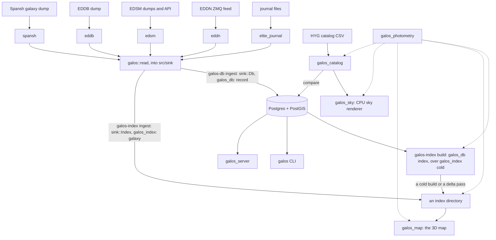

# Architecture

A map of the workspace: what each crate is for, which way the data runs, and
where the seams are. It is a map and not a manual — the arguments live in the
module headers, and this says which one to open.

Two datasets meet here. Elite's own, arriving as events and kept in Postgres,
authoritative and always growing. And the sky as it is measured from Earth,
read from published star catalogs. They meet at three quantities — a position,
an absolute magnitude, a temperature — and nowhere else.

Between the database and the things that draw stands one derived artefact: a
directory of index files. The database is the authority and it is a server; the
index is a snapshot of it and it is a file format. The map reads the index and
never opens a database connection. That split is the load-bearing decision in
the workspace, and most of what follows is a consequence of it.

Elite's own dataset arrives two ways. EDDN carries everyone else's game; the
commander's *own* game is written to journal files on their own machine. Both
are publishers of the same events and either sink takes them, so a run naming
both merges the world and the commander as it writes:
`galos-index ingest --from eddn --from journal=DIR --dir DIR` is one
directory holding the pair, and the map reads one directory.

## Which way the data runs

Solid arrows carry data. The dotted ones are `galos_photometry`, which carries
no data at all — it is the shared vocabulary for brightness, colour and where
light lands, and it is a dependency of everything that has an opinion about
those.

## The crates

Sizes are tracked Rust lines under each crate's `src/`, and they are here
because the distribution is itself a fact about the project: three fifths of
it is one client.

| Crate | Lines | What it is |
|---|---|---|
| `galos_map` | 53,787 | The 3D galaxy map. A bevy application, and a pure index client |
| `galos_index` | 14,516 | The octree, its format, the two inputs that fill it, and the walks that read it |
| `galos_db` | 9,019 | The database: one module per entity, plus the index builder |
| `galos` (root) | 11,266 | Three binaries — `galos`, `galos-index`, `galos-db` — and the library they share |
| `galos_catalog` | 2,353 | Earth-measured star catalogs, and comparing them to Elite's sky |
| `galos_sky` | 2,089 | A CPU renderer for one patch of sky, to look at the physics |
| `galos_photometry` | 1,809 | Magnitudes, temperatures, colours, and the point spread |
| `spansh` | 1,140 | Spansh's published galaxy dumps, framed and parsed a line at a time |
| `galos_server` | 321 | An axum + askama HTML front end over the database |

The root package is four directories, and its row above counts `src/` and
`bin/` together: `bin/galos` the query CLI, `bin/index` and `bin/db` the two
store tools, and `src` what they and `tests/derivations_agree.rs` share —
`read/`, `sink/`, `bar`, `shutdown`, `shard`.

Four more are git submodules with their own release cycles, patched in by path
through `[patch.crates-io]` (`Cargo.toml:58-63`): `elite_journal` (the game's
journal format, the shared event model everything else speaks, and the reader
that follows a journal directory), `eddn` (the EDDN ZMQ gateway), `edsm` and
`eddb` (dumps and APIs from two third-party sites, one of them defunct).

`galos_gui` (196 lines) is commented out of the workspace members list, as
are `elite_dat` and `galos_worker`, whose directories are gone.

## 1. Ingest

**Six publishers, two tools, one verb apiece.** `galos-index ingest` and
`galos-db ingest` are where the galaxy moves from wherever it is published
into somewhere it can be read. `--from` names a publisher and repeats: `eddn`
(the live feed, a subscription that never returns), `spool=DIR`,
`journal=PATH`, `edsm=PATH`, `edsm-api=NAME`, `eddb=PATH`, `spansh=PATH`. The
tool is the sink, so nothing names one: filling both is the two commands side
by side, over one `galos::read` and one `read::Qualifiers`.

**Two write routes, and the choice is memory.** `ingest` holds a live tree and
the whole names table, about a kilobyte a system, and publishes on
`--publish`'s beat, so a map can read the directory as it is written; `build`
holds one region at a time and publishes nothing until it is whole — over a
two hundred million system dump, some 200 GB resident apart
(`bin/index/fill.rs:6-16`). Both fill it from the events: **an index is kept
current from what is published, not from the database**, which is what
`galos-index build --from database` rebuilds it from.

**And so `galos-index` holds no database client**: built
`--no-default-features` there is no `sqlx`, no `dotenv`, no `DATABASE_URL` in
it. Three seams in `src/sink/mod.rs` buy that — `Landed` declared there rather
than re-exported from `galos_db`, `sink/db.rs` converting (`mod.rs:82-88`);
`Stop`, a bare `Fn` (`mod.rs:126-132`); and `Clock`, the one thing the index
sink wanted a `Database` for (`mod.rs:139-155`).

**A published dump is an import, not a feed.** `galos-db ingest --bulk` says
so: the pool opens with `synchronous_commit = off` and a ceiling of sixteen
connections rather than five, so a commit returns without waiting for the
write-ahead log to reach the disk and a crash loses the last of what was
committed — rows re-derivable from the file being read. `--shard I/N` is one
process's share of that file, every Nth record, so N of them cover it exactly
once between them; what a record is belongs to the source, the line-oriented
dumps counting lines and a journal directory counting files. It is safe
because every write a shard makes is a guarded upsert keyed by an address, so
two shards over one record cost time and nothing else (`src/shard.rs`,
`galos_db/src/lib.rs:51-56`, `bin/db/main.rs`'s `BULK_CONNECTIONS`).

`src/sink/` is the seam, and its header says what shaped it — not what
either sink wants, but what the sources have to say. There turn out
to be exactly two shapes:

- **An event.** `Sink::entry`, one `elite_journal::Entry<Event>` and a
  `Reporter` saying who it is by: a `Commander` where a journal named one, an
  `Uploader` where EDDN named only its anonymised sender or a dump named the
  file it was read out of, `Nobody` where nothing named anybody at all. Both
  sinks take whatever was named — `updated_by` is provenance, and a
  published file's own name is the only provenance a dump has — and a source
  that names somebody is what stops a feed's scans being filed under
  whoever is flying locally. The name crosses the index worker's channel as
  `relay::Named`. Journal files and EDDN carry the same events, so this is
  the whole of both. Four EDDN schemas carry a payload with no `event` key
  and get a method apiece.
- **A system report.** `Sink::system`, a `galos_index::SystemReport`: a name,
  a place, the political columns and the body counts. What the EDSM and EDDB
  dumps hold and all they hold — nobody flew anywhere, a file was published —
  and also what every event naming a system reduces to. It is how a sink is
  told a system exists before anything keyed onto it arrives, which Postgres
  needs for its foreign key onto `systems` and an index needs not at all.

`SystemReport` is the shared vocabulary above body level, and it lives in
`galos_index::report` beside the rule for what a second report does to a
system: one fifteen-arm match over the events that name one, answering both
derivations, rather than one apiece that have to agree about which events
those are. Below body level the shared vocabulary is `elite_journal`'s own
`Star` and `Body` — a scan is the only thing that ever states one, so there
is nothing to reconcile and no wrapper for it.

Three rules and one set of tables live in `galos_index` and nowhere else:
`SystemReport::over` for a system's columns, `galos_index::merge` for the
things inside one, and `galos_index::sidecars::Sidecars` for the five
metadata files that ride beside the cell tree — their read-back, their
compare-and-set and their write-what-moved. `galos_db`'s `ON CONFLICT DO
UPDATE` clauses are a second copy of the merge rules, kept because Postgres
merges against a row Postgres holds — reading it back would be a round trip
and a lost update per message — and pinned to them by three tests in
`galos_db/tests/write_path.rs`, one each for a system, a star and a body,
rather than by having been read carefully.

What deliberately did *not* move into `Sidecars` is the half that differs:
where a row comes from, and that only the database side can *withdraw* one.
It re-reads `population > 0` from the row, so it can tell a system that has
emptied from one nothing has mentioned. A feed cannot — no population in
hand is the answer for a system that never had one, one that has emptied and
one merely named by a passing route — so it withdraws nothing and keeps what
the directory published.

The two sinks:

- `sink/db.rs` is the write path that has always been here.
  `galos_db::record` sits behind it and its header states the invariant:
  journal files and EDDN carry the same events, so "a scan is a scan either
  way". What it fans out on `Event::*` for is the fourteen `galos_db` entity
  modules — the stations, markets, signals, codex sightings and factions the
  index has no column for. The system itself it does not read off the event at
  all: `SystemReport::of` does that, once, for both derivations. Two rules are
  recorded there: a refused write is warned and the loop continues, "since a
  feed that stopped at the first system it could not place would stop for
  good", and the system's row is written before anything that references it.
- `sink/index.rs` is the event-sourced half: `galos_index::Galaxy`
  accumulating events into the index's vocabulary, a `galos_index::Tree`
  held open and edited one system's path at a time, `sink/tables.rs` driving
  the shared `Sidecars` from the galaxy rather than from rows, a
  `galos_index::Published` keeping the scanned bodies in the directory's own
  body files rather than in memory, and a `Checkpoint` to resume from. Its
  resume point says which of the two derivations wrote it: a directory built
  from Postgres and one written from a feed are not the same artefact, and
  neither resumes onto the other's work. See §5.

`sink/` is in the library rather than in either tool, and that is what
`tests/derivations_agree.rs` is for: one list of events handed to each sink,
and everything either directory publishes about the systems the test owns
compared row for row — names, populated columns, reaches, supercharges and
every system's bodies. It would have caught every drift the two have had.

`galos::read::derive` is the worker that makes the two agree on start. Under
`galos-index ingest --catch-up` it runs `galos_db::index::catch_up` first —
build or delta, the database clock taken before each read — while the collect
side buffers what it reads for the index. Then it opens the sink on what the
catch-up wrote, drains the buffer into it, and goes live. A buffer that fills
is discarded and another round runs instead: everything discarded reached
Postgres before the relay dropped it, so the rounds converge and nothing is at
risk (`src/read/derive.rs:86-93`). `bin/index/fill.rs::ingest` is the
supervisor over both halves — the directory's lock, the worker thread, the
signal handler and the exit code.

## 2. The database

`galos_db` is one directory per entity — `systems/`, `bodies/`, `factions/`,
`stations/`, `markets/`, `stars/`, `rings/`, and ten more — each holding
`mod.rs` (the type and its domain rules), `create.rs` (the write path) and
`fetch.rs` (the read path).

**The write path is one shape, repeated.** A single
`INSERT … ON CONFLICT DO UPDATE` in which every column is
`CASE WHEN $sent >= row.updated_at THEN COALESCE(new, old) ELSE COALESCE(old, new) END`.
So the newer reading wins a conflict, an older reading still fills a blank —
"a blank is not a reading it can contradict" — and `updated_at = GREATEST(old,
sent)` keeps a late message from rewinding the stamp. Stated in full at
`systems/create.rs:10-21`. A refusal writes nothing and returns no error,
which is why `lib.rs:128-145` logs it: so a guard that fires correctly can be
told from one that never fires.

`Database::now()` (`lib.rs:108-119`) records the rule every follower obeys:
read the clock before the question it stamps, because rows carry the
database's clock and a client clock running fast loses writes for good.

**Geometry.** Exactly one geometry column exists: `systems.position
geometry(POINTZ)`, indexed `USING GIST (position gist_geometry_ops_nd)`. Range
queries are `ST_3DDWithin`. 90 migration files under `galos_db/migrations/`.

**Offline builds.** 75 cached query files in `.sqlx/` at the workspace root, so
`SQLX_OFFLINE=true cargo build` works without a database; CI sets it
workspace-wide. The index builder deliberately uses *unchecked* `sqlx::query`
so the build tool needs no compile-time database
(`galos_db/src/index/mod.rs:8-10`).

**What the tests defend.** `galos_db/tests/write_path.rs` is 2,938 lines and
its header says why: the sqlx macros prove a statement is valid against the
schema, and say nothing about "whether the row lands, whether a second message
replaces the first or sits beside it, or whether a key onto something absent
stops the write — and every one of those is a decision made per table here."
It runs against `TEST_DATABASE_URL` and never `DATABASE_URL`, and skips when
there is no server there, which is how CI passes offline. What the variable
names is a server: each test gets a migrated database of its own from
`galos_db::testing`, a copy of the `galos_test_template` the migrations are
run into once, and drops it as it ends.

## 3. The index build, and the seam

`galos_db/src/index/` is where the derived index meets the authoritative
dataset. It reads Postgres, derives photometry through `galos_photometry`'s
fallback chain, and hands pure `galos_index::System` values to the builder —
"the two crates meet at `System`" (`index/mod.rs:3-5`). The build's own
sequence is not here: `galos_index::cold` holds that, and what this crate
does is push its rows into the builder — one streamed read, a record at a
time, and nothing about a tree.

`galos-index build --from database [--watch SECS] [--only PART,…]` is the
verb that derives one. `catch_up` is build-or-resume followed by delta passes
until a pass finds less than a chunk left; `--watch` keeps polling after that,
and `galos-index ingest --catch-up` calls the same `catch_up` once at startup
and then maintains the directory from events instead. `Parts` is
`{cells, names, populated, reaches, boosts, factions, bodies}`, and `--only`
is for a change to how one part is derived, which leaves every published copy
of that part stale while everything beside it is fine: rebuilding the lot to
fix one is "a hundred megabytes of rewriting to say nothing new"
(`bin/index/fill.rs`'s `Part`, `galos_db/src/index/mod.rs:30-36`). Two
invariants hold it: a part left out is left exactly as it stands, and nothing
here ever removes a file, so a partial build leaves the index older but never
short. The supercharge table is read off the nearest scanned star rather than
off `systems.primary_star_class`, which only a plotted route ever writes and
which leaves a scanned neutron star in nobody's table; a directory published
off the column wants `--only boosts` once.

**The seam is a directory.** Default `.galos_index`. No IPC, no shared process,
no database on the reader's side. `galos_db` depends on `galos_index`;
`galos_index` does not depend on `galos_db`.

| Path | Format | Resident in the map? |
|---|---|---|
| `index.bin` | the cell tree's aggregates, `GIDX` magic + version | yes — every walk plans on it |
| `cells/LL-<morton>.bin` | fixed-width payload records, 41 bytes a system | fetched per cell, on demand |
| `names/NNNNN.bin` | MessagePack `NameTable` chunks | yes, ~112 MB |
| `populated.bin` | MessagePack, address-ordered | yes |
| `reaches.bin` | MessagePack, address-ordered | yes |
| `boosts.bin` | MessagePack, address-ordered | yes — the router asks it per candidate |
| `factions.bin` | MessagePack, id-ordered | yes |
| `bodies/<shard>/<address>.bin` | MessagePack `SystemBodies` | fetched per system, on demand |
| `<dir>.checkpoint` | `GALOSCKP` header + fixed-width `System` records | never served — outside `DIR` |
| `<dir>.checkpoint.pending` | framed records, one frame per publish | never served — outside `DIR` |

The body files are sharded over 4,096 directories because one flat directory
would hold 37 M files at 200 M systems. The shard is the top twelve bits of
`address * 0x9E37_79B9_7F4A_7C15`: an `id64` packs a mass code and boxel
coordinates into its low bits, so `address % 4096` leaves 1,200 of the shards
empty and piles 3,290 files into one, while the multiply fills all 4,096 with
a median of 129 and a maximum of 170 (`galos_index/src/source.rs`).
`reshard_bodies` moves a pre-sharding directory's loose files down, and a read
falls back to the flat path until it has. It is a rename per file and minutes
of them over a galaxy, so it is asked before each move whether the run has
been stopped: what it abandons the next open takes up, and the fallback is
what makes a half-migrated directory serve what a finished one does.

The resume point is a compacted base and a log of what has been published
since. A publish appends a frame — how many systems it moved, the cursor that
holds once they are applied, and the systems themselves — and the base is
rewritten only when the log has grown past a sixteenth of it. It was one file
holding every system, written whole on a sixty-second timer: 162 MB a minute
at 2.7 M systems and 11 GB a minute at 200 M, which is not a timer setting
that helps. The base is a 64-byte header and then nothing but 56-byte
`System` records exactly as the machine holds one, so a resume maps it and
builds the tree from a `&[System]` pointing into the mapping rather than
decoding a galaxy onto the heap. That makes the file this machine's — native
order, native layout, a magic read as a native `u64` and a record width in
the header — which is affordable because it is private, never served, and a
refused one costs a rebuild. A file in the old MessagePack form is upgraded
the first time it is read (`galos_index/src/checkpoint.rs`).

Three contracts cross it. **Durability**: every metadata table is written to
`<path>.tmp` and renamed, the rename being the only step that touches the real
path, because a table carries no length, count or magic of its own and "a torn
write is the one failure the format cannot detect"
(`galos_index/src/source.rs:202-206`). **Determinism**: the whole tables are
sorted by address before writing, so the same content is the same bytes.
**Consistency**: the directory is valid only if its names table and its cell
tree stand for the same set of systems, which is why one read produces both
(`galos_db/src/index/mod.rs:227-231`) and why a watch restart checks it
before resuming (`mod.rs:678-693`).

The watch cursor is worth one paragraph because it looks wrong until you read
it. `changed_addresses` (`mod.rs:178-201`) selects on `received_at`, not
`updated_at`: `updated_at` is the time the event describes out in the galaxy,
and comparing that against a cursor compares an event's time against the time
somebody happened to look, so a journal import of year-old entries is never
asked for. `received_at` is stamped by the upsert, so one clock is compared
against itself. There is a regression test,
`an_old_event_timestamp_still_reads_as_newly_arrived`.

**A cold build holds nothing the galaxy's size, and its sequence is
`galos_index::cold`.** The buckets a system spills into on arrival, the cut
formed from their counts, the crown, each region's own build and the join
are `bucket.rs`'s and `region.rs`'s pieces in the order they go in, and the
only thing that sequence asks of a caller is a push per record:
`Build::push(system, name)` until the records run out or it answers
`Taking::Stopped`, then `Build::finish`, which writes the payloads, the
names table, the index file and the resume point — or, asked to stop,
writes none of them and says how far it got. Beside it,
`galos::read::cold` writes the three metadata tables a record can
fill, held across the read and written once `finish` has answered;
`factions.bin` is the one no record can fill, and stays absent rather than
empty. `galos_db::index` pushes its
rows off its own SQL cursors and keeps everything database-shaped —
`systems` and `stars` streamed in address order and **merged**, so one star
is held rather than a map of every scanned system, and one read serving the
cell tree and the names table both, because the two must stand for the same
set of systems. `Snapshot::build` wants every system at once, so the galaxy
is cut into regions of at most `REGION_BUDGET` systems — seven million,
which at about 298 B a system is the two-gigabyte budget the builder is
written against — each spilled to a file of its own, built off the mapping
of that file, its payloads written and only its cells kept. What is held at
the end is every cell in the galaxy, which is the index file. No live `Tree`
is raised: a watch gets one by resuming from the resume point the build
leaves.

Measured over 2.73 M systems: **1.14 GB peak resident and 98 s** for a full
build, against **5.19 GB and 162 s** when its reads were buffers rather than
cursors. A watch pass still reads its chunk with
`= ANY($1)`: it is bounded by the chunk, and it needs the whole group to say
which addresses came back with nothing.

## 4. The index

`galos_index` is the format both sides agree on and the machinery that reads it
back. Its header names what it rests on: the aggregates a cell carries **must
compose exactly**, so a region drawn coarse and the same region drawn fine
integrate to the same totals and a cross-fade between them cannot pump
brightness or lose a star. That is `moments.rs`, and it is built and tested
first because everything else leans on it.

- **The cube.** `geometry.rs`: a sparse adaptive octree, root edge 131,072 ly
  centred on `[0, 900, 24400]`, `MAX_LEVEL` 21. `CellId` is a level plus
  integer coordinates, with Morton ordering.
- **The build.** `tree.rs`: `Snapshot::build` for a full pass and an editable
  `Tree` with `insert`/`remove`/`split`/`collapse` for the watch. `LEAF_CAP`
  4096, `INTERNAL_SLICE` 512. Aggregates are recomputed at publish rather than
  maintained.
- **The aggregates.** `aggregate.rs` and `moments.rs`: minimum magnitude,
  count, flux across six temperature buckets, light- and mass-weighted moments
  with exact merge *and remove*, and eight age buckets.
- **The format.** `serialization.rs`: fixed-width records and a 41-byte
  payload record carrying its position as three full `f64` and its magnitude
  as `f32` — chosen over quantising into the cell so that "a block stands on
  its own without its cell" (`serialization.rs:19-20`).
- **The walks.** `walk.rs`: `Index::needed(view, mode)` answers what the view
  needs, and drawing, fetching and eviction are the same predicate read three
  ways — "One predicate, three consumers." `Mode::Shell` is the map's overview;
  `Mode::Real` is the sky, one photometric quantity split at the visibility
  floor rather than two modes. Constants: `SPLIT_PX` 0.5 and `SPLIT_FULL_PX`
  1.0 (the cross-fade band a level handoff crosses, cut at half a pixel of a
  cell's contents so the field's frontier follows the pixel grid), `MERGE_PX`
  4.0 with a `MERGE_BAND` of an octave, `STAR_MERGE_PX` 2.0,
  `GLOW_OPENING_ANGLE` half a degree.
  **The merge rule** (`Index::frontier`): a cell whose whole contents fall
  inside one mark is drawn as one — a `BlobRef` off the aggregate, nothing
  read — and a cell wider than that is descended into and its own slice is
  read. What a cell is judged on is its contents' *width*, rolled up from
  its children's centroids (`walk::widen`) rather than the RMS radius: a
  filament's radius is a third of its length, so a scalar test merged three
  marks' worth of line into one.
  **What the frontier does not say is how much of a marked cell is drawn**,
  and it cannot: the drawn density has to follow the sky's own, and that is
  a statement about the whole frame. `galos_map`'s `bounded::share` strikes
  one figure over every marked cell — a share of its *population*, so ten
  times the systems draw ten times the marks — and `bounded::wanted`
  dithers the fraction against the cell's address so a cell wanting a third
  of a mark draws one in a third of the places. Two rules were tried before
  it and both flattened the galaxy: a share of a cell's screen *footprint*
  draws the same count over the same patch whatever is in it, and a floor
  under that figure drew nothing at all in the finest cells, which is where
  the sky is densest.
  **The invariant** (`Index::frontier`): the cuts are pure functions of
  where the eye is — no budget, no frustum, nothing history-dependent — so
  the same eye position always returns the same view.
- **The transport.** `source.rs`: an async `Source` trait over cells *and*
  metadata, `FsSource` today and one HTTP implementation later, boxed so a
  client holds `Arc<dyn Source>` and swaps the whole transport at once. `Part`
  and `Stamp` are what makes a cheap change check possible.
- **The inputs.** Two, and neither names a source. `cold.rs` and `region.rs`
  take records — a database's rows, a dump's lines — and raise the whole
  galaxy at once, a region at a time (§3). `galaxy.rs` and `bodies.rs` take
  events one at a time, from a feed or a commander's own files, and
  accumulate them into `System` records and the metadata sidecars (§5).
- **Residency.** `cache.rs`: `Resident` and the set arithmetic `missing()` /
  `evictable()` against a `Needed`.

Two large modules are easy to mistake for map code and are not.
`inside.rs` (1,057) and `orbit.rs` (1,172) are the shared Kepler and
system-arrangement arithmetic: the index build derives the reach table with
them and the map draws a system's insides with them, held in one crate
precisely so the two answers cannot disagree.

`galos-index info DIR` summarises a built directory.

## 5. The commander's own journal

The other way Elite's own dataset arrives, and the one with no server
anywhere in it: a reader, an accumulator, and a directory both halves of the
galaxy are written into.

**The reader** is `elite_journal::journal::Journal` — a directory of `.log`
files and how far into each of them has been read. `Journal::poll` hands back
everything written since the last one, which on the first call is a
commander's whole history and on every call after it is the tail. Three
things make that harder than `tail -f`, and they are `follow.rs`'s
(`elite_journal/src/journal/follow.rs`). A line may be half written, so a
read stops at the last newline it saw and leaves the rest for the next poll;
nothing is parsed that is not a whole line, so a torn write costs a poll's
latency and never an event. A file may be replaced, so its length and its
modification time are kept beside the offset — shorter than it was, or dated
before the reading was taken, and it is read again from the top, applying an
event twice being free when everything downstream is keyed by address and
body id. And `NavRoute.json` is read beside the logs and handed back as the
`NavRoute` event the log's own is written without: it is the only place a
journal names systems the ship has not been to.

`Journal::watch` is that on a beat, on a thread of its own, and what the beat
waits on is what the crate's `watch` feature buys. With it, the filesystem —
inotify, kqueue, FSEvents or `ReadDirectoryChangesW` — so a jump is read as
soon as the game has written the line and the beat is only the longest the
watch will wait without being told anything. Without it, the clock: one
`stat` per log file every beat, and a jump up to one beat late. The same
`Journal` and the same `Read` either way, the feature buying latency and not
capability.

**The accumulator** is `galos_index::Galaxy`, and it is not the journal's.
What reaches it is an `Entry<Event>` and nothing about where it came from, so
EDDN's feed, a commander's `.log` files and a relay all land the same way. The
fan-out is not merely the same one `galos_db::record` does — it *is* that one,
both sides calling `SystemReport::of`. What differs is where it lands:
`galos_db::record` writes fourteen tables and a build reads them back, while
this keeps the two shapes the index wants, `System` and the metadata records,
and skips the round trip. Merged rather than replaced, which is
`SystemReport::over` and `galos_index::merge` — the write path's own
`ON CONFLICT DO UPDATE` clauses stated in Rust: a `Scan` arriving after an
`FSDJump` does not take the system's politics away, and a basic `AutoScan`
arriving after a detailed one — which is what the game writes every time a
ship re-enters a system it has already looked at — does not take the surface,
the materials or the tidal lock away. Names are upper-cased, because every
write of a `systems` row is and the two paths publish one table.

`galaxy.rs`'s header states the three things an event cannot say. **Factions
have no ids**: a faction's id is `galos_db`'s, minted when the row is first
written, so `Galaxy` publishes no faction table and leaves
`PopulatedSystem::factions` empty rather than mint ids of its own, which
would collide with real ones and colour the map by the wrong faction. **A
system's own row is a sighting** — what the events fed in happened to say,
not everything anybody has ever reported. **Most systems have no scanned
star**: the `primary_star_class` column a database-derived build falls back
to is written by a plotted route and no event carries one, so past the
classes that have been scanned and the ones a route named, the default stands
in — exactly as it does for a system EDDN knows nothing about either.

**The scanned bodies are a store, not a field.** `galos_index::bodies`, and
which of its two is right depends on what is reading. `Galaxy` needs a
system's *whole* insides every time one more body of it arrives — the reach
is the far edge over every body, star and barycentre together, and the
published body file is written whole — so it cannot look at a scan and forget
it. `Kept` holds them in memory, which is what `Galaxy::new` gets and what an
accumulator with no directory behind it wants. `Published` keeps them in the
index directory's own `bodies/<address>.bin`, which is where they were going
anyway, and is what a feed needs: a `meta::Body` is 376 bytes before its four
strings, its parents and its materials, so holding everyone's scans is a
process that grows for as long as it runs.

**The join is at write time.** `galos-index ingest --from eddn --from
journal=DIR --dir DIR` reads both publishers into one directory — one tree,
one set of tables, everybody else's galaxy and this commander's merged by the
same `SystemReport::over` that merges two readings of anything else. The map
reads that one directory through `FsSource` and knows nothing about where a
system came from. A journal into Postgres instead is `galos-db ingest --from
journal=DIR`, whence the ordinary build picks it up; filling both is both.

A directory written from events is not one a database-derived build rewrites:
the resume point records which derivation wrote it and the two refuse to
resume onto each other's work (§1), so a commander's unshared readings are
not sitting in an artefact something else owns and will rebuild over. What it
costs is that they are *in* the directory rather than beside it — asking what
the galaxy looks like without them is a second directory ingested from the
feed alone.

## 6. The physics

`galos_photometry` is the vocabulary: `Magnitude`, `Flux`, `Temperature`,
`Color`, `Luminance`, `Distance` (unit-carrying), and `ClassLight::of`, which
turns a spectral class into a typical magnitude and heat — the last link in
the index build's fallback chain, and what lets a system with nothing recorded
but its primary's letter still take its place in the ordering.

Three of its items are about the instrument rather than the light, and the
header says why they live here: `Magnitude::EYE_LIMIT`, `Magnitude::exposure`
and `psf` decide **how much light lands and where**, "the one quantity two
renderers of the same sky must agree on exactly." `psf.rs` models the spread as
a stack — a tight seeing core plus a broad aureole — because one profile can be
a sharp core or a broad halo but not both.

Nothing here knows about the database or a renderer.

## 7. The map

`galos_map` is a bevy 0.19 + bevy_egui client. It links `galos_index`,
`galos_photometry` and `elite_journal`, and **not `galos_db`** — routing used
to be a database question and is now a walk over the resident names table
(`systems/route/graph.rs:3-5`).

Read it in this order. Each step is a prerequisite for the next.

1. **Units and placement** — `space.rs`. An `f32` holding 10⁵ ly has ~10⁻³ ly
   left, "coarser than a whole star system is wide", so positions are
   `big_space`'s integer cell plus an `f32` remainder, relative to whichever
   entity holds `FloatingOrigin` (the camera). The map counts in **metres**,
   not light years, and `space::metres` is the one conversion. Galaxy cell edge
   is 2^53 m — a power of two, so cell × edge is exact.
   An `f64` is no way out of it either: 10⁵ ly leaves ~10⁻¹¹ of one, some tens
   of kilometres, so an absolute galactic position cannot name a metre out at
   the rim. Which is why the camera holds its orbit in the frame of whatever
   it has descended into (`camera.rs`, `OrbitCamera::origin` and `rebase`) —
   the galactic centre out among the stars, the held system's own position
   once inside one. Zoomed onto a neutron star the camera stands tens of
   kilometres off it, so added to a galactic center that offset was smaller
   than one rounding of the number it was added to and simply vanished: the
   view jumped about as it was zoomed in, and only ever about a body small
   enough to be looked at from that close. `center()`/`eye()` publish the
   galactic position for the galaxy-scale readers; `center_from`/`eye_from`
   answer in a system's frame and are exact while the camera stands in it.
2. **The frame's order** — `schedule.rs`. `MapSet` is
   `Search → Fetch → Populate → Camera → Present`, chained in `Update`. Most of
   the map is a pipeline and running it out of order "still works, it just does
   each step with the previous frame's answer." The egui painters do **not**
   run in `Update` — they run in `EguiPrimaryContextPass`, later in the same
   frame and still ahead of `PostUpdate`.
3. **What is held** — `lib.rs`. `Transport(Arc<dyn Source>)` is the only I/O
   seam, and `main.rs` is the only place `FsSource` is named. Beside it:
   `ResidentIndex`, `Names` (2.5M entries, with a `fresh` overlay for the live
   feed), `Populated`, `Boosts`, `Factions`. Each field carries the cost
   argument for being resident.
4. **Where stars come from** — `systems/bounded.rs`. One source: the walk
   reads the index for the cells a view marks and spawns one entity per
   system in their payloads, clamped to the spyglass reach when the bound is
   on (`bounded::reach`). It replaced a spyglass region fetch that read a
   full-density sphere, which is what exploded on zoom-out. `systems/fetch.rs`
   keeps what nobody asks about by place: a route's legs and a picked-out
   system. Everything joins at one queue pair, `PendingSpawns` and
   `PendingEvictions`, and the rest of the map reads a `System` component
   without caring what put it there. `systems/aggregate.rs` holds the one walk
   both the marks and the splats read, so the two can never disagree about
   which cells are which.
5. **How anything reaches the screen** — `systems/labels.rs`'s header, which is
   the index over the flat-painting design. A mark built at a system's true
   coordinate goes through the clip transform in `f32` at the scale of the
   camera's galaxy cell, where one part in 2²⁴ is millions of kilometres, so it
   tears. Five sites therefore project to a pixel on the processor in `f64` and
   paint flat: `field::build_field` (the star field, as one mesh),
   `labels::draw_names`, `pointing::ring`, `selection::ring`,
   `grid::draw_readouts`. The header also records **one answer per question** —
   a star's drawn radius is `field::drawn_radius` and nothing else, a body's
   position is `Places::of` and a system's is `System::position` — both rules
   learnt from bugs.
6. **The cameras** — `camera.rs`. Three, and the layer and order constants
   document themselves: scene at order 0 on the default layer, carrying
   `FloatingOrigin` and the scene's bloom; the field at `FIELD_ORDER` 1 on
   `FIELD_LAYER` 5, drawn by a camera at the world origin so nothing it
   rasterises carries a galaxy-scale coordinate; annotations at
   `ANNOTATIONS_ORDER` 2 on `ANNOTATIONS_LAYER` 2, holding egui's primary
   context. Stacking inside the shared egui layer is run order, pinned
   pairwise — see `labels::annotations_layer`.
7. **The ruler** — `grid.rs` for the map's policy (which unit, where the ruler
   changes hands, what is worth locating) and `ruled/` for the renderer, a
   self-contained fullscreen shader pass generic over any `big_space` world
   that names no length. `grid.rs:37-57` is the sharpest recorded decision in
   the crate: a light year is 3.15576e7 light seconds, no power of ten, so the
   galaxy's ladder and a system's share no cell size at any zoom and would beat
   against each other — therefore "the one is spent before the other begins,
   with a moment of unruled sky between them. That moment is the honest
   reading."
8. **Routing** — `systems/route/`. `graph.rs` is A* over positions bucketed on
   a 64 ly grid, with three modes whose measured costs are in its header
   (Sol→Colonia at 50 ly: `Quick` 458 jumps in 0.08 s, `Direct` 458 in 1.8 s,
   `Shortest` 458 in 3.2 s — "only the middle row *proves* it is the fewest,
   and that proof is nearly all of the time"). `frontier.rs` draws the search
   while it runs, in three layers, because "a search that will not finish looks
   exactly like one that is about to". `tour.rs` orders a set of destinations,
   exactly up to ten and by improvement past that, and claims nothing about
   optimality because its leg costs are estimated.

`refresh.rs` is what makes a `--watch` build visible without a restart: a
`Stamp` per `Part`, polled with one `stat`, and each table re-read whole or
patched according to what a publish costs to write.

`dev.rs` is a read-only diagnostics window on F3, and is stated as droppable
by dropping the plugin.

## 8. The other programs

- **`galos`** (root `bin/galos/`) — `search` and `route` against the
  database. The interactive TUI sketched in `src/lib.rs:18-33` is not built;
  the `tui`/`termion` dependencies are unused.
- **`galos_sky`** — renders one patch of sky to a PNG on the CPU, so the
  photometry can be looked at without a swapchain and so the map's response law
  can be developed against a picture. Guarded by a golden image of the Big
  Dipper (`tests/golden.rs`).
- **`galos_catalog`** — reads published star catalogs (HYG today) into the same
  position / absolute-magnitude / temperature vocabulary the index build
  produces. It has **no `galos_db` dependency** and its header argues why: it
  is a peer of the index build, not of the database, and "knows nothing about
  the tree, the renderer or Postgres". `compare.rs` fits the rotation between
  two datasets from matched stars rather than assuming it, "so a wrong guess
  about axes cannot masquerade as every star being in the wrong place".
- **`spansh`** — Spansh's published galaxy dumps, read a line at a time.
  `systems.json` is every system's name and place; `galaxy.json` is the same
  with every body and station nested in it. Each file is a JSON array holding
  one whole object per line, so the framing is a `read_line` and the parsing
  is `serde_json` per object, and nothing is held whole — which is what lets
  610 GB be read in a process that grows no further than its longest line
  (`spansh/src/lib.rs`). `galos-index build --from spansh=PATH` is the cold
  route over one; either tool's `ingest` reads the same source.
- **`galos_server`** — 321 lines of axum with six askama templates: an index,
  a system list, and pages for a system, a station, a body and a route. Live,
  thin, and untested.

## Where the design is written down

**Module headers are the record.** They are long on purpose and they argue
rather than describe; several state a decision that was made the other way and
say why. The ones worth reading first, in order: `galos_index/src/walk.rs`,
`galos_map/src/systems/labels.rs`, `galos_map/src/space.rs`,
`galos_map/src/grid.rs`, `galos_index/src/region.rs`,
`galos_db/src/index/mod.rs`, `galos_photometry/src/lib.rs`.

**`galos_map/README.md`** covers using the map: the mouse gestures, the key
bindings, and a short account of how it draws.

The rest of `doc/` is **kept out of the repository** (see the note in
`.gitignore`), so a fresh clone holds this file and nothing else beside it:
`doc/ROUTING-INDEX.md` (the routing-index spike the router grew out of),
`doc/galaxy.md` (the spatial hierarchy and the level of detail, ~2,150
lines), `doc/sky.md` (the photometry, and a record of the colour-luminance
bug), `doc/serving.md` (what serving the index over HTTP would take — a plan,
not built), `doc/name_mapping.md` (resolving catalog names against Elite's —
a plan, not built) and `doc/IDEAS.md`. `TODO.md` stays at the root, where it
is in the way: it is everything still open — including what is designed and
not built, which `CONTINUE.md` used to hold — with the measurement behind
each item.

## Honest notes

Two files are much larger than their stated scope, and the seams are already
visible in the source:

- **`galos_map/src/ui.rs`, 8,610 lines** for a header describing "a gear, the
  bar beside it, and the settings pane". It is at least four concerns:
  typography and metrics (pure functions, already consumed by `info.rs` and
  `grid.rs`); input arbitration (`PointerOverUi`, `Keyboard`, `PressOwner`,
  `Gesture`, `settled_click` — a policy layer with no drawing in it); the bar's
  three sections, which the header itself says "have nothing to say to the
  other two" and which already own separate `SystemParam` bundles; and the
  bindings window. Those bundles exist to dodge bevy's sixteen-parameter limit,
  which is itself the size signal. A split has to preserve the pinned order
  `lettering → (panels, names, rings, readouts) → chrome`.
- **`galos_map/src/systems/info.rs`, 3,746 lines** — about 600 lines of panel
  machinery and 3,000 of a description library (`&DbBody` → `String`) with no
  panel logic in it. The sharper seam of the two, and it is already leaking:
  `lasting` is `pub(crate)` and consumed by `ui.rs`.

`galos_map/src/systems/labels.rs` is 3,171 lines and does two jobs, but its
header claims that deliberately: names, plus the projection every other flat
painter imports, "having one set of it rather than five is the point."

## Building and testing

Stable toolchain (`rust-toolchain`); 80-column `rustfmt` with
`use_small_heuristics = "Max"`. `cargo test --all` is what CI runs, with
`SQLX_OFFLINE=true` and the submodules checked out.

CI carries one hand-written check worth knowing about: the four submodules are
taken by path through `[patch.crates-io]`, and a patch applies only while its
version still satisfies what asked for it. Bump one without bumping its
consumer and the patch silently stops applying — the published copy comes down
beside the working tree, and two of a crate in one graph means two of every
type in it. Cargo will not say so, so the workflow greps `cargo tree
--duplicates` for each of them (`.github/workflows/ci.yml`).

See [README.md](../README.md) for prerequisites, database setup and how to run
each program.
