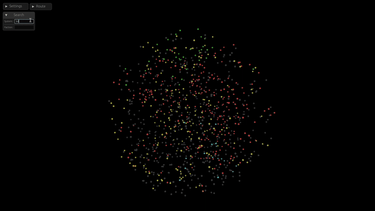
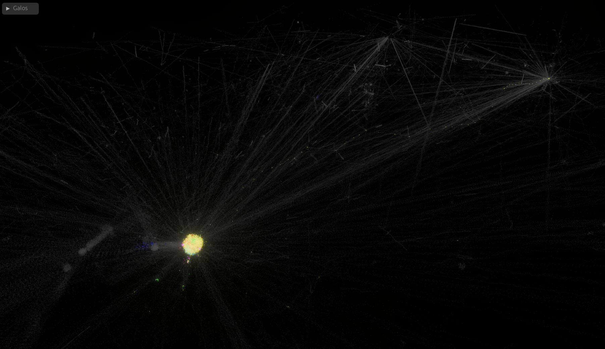

# Galos Map



```sh
cargo run --release
# Connect to a remote postgresql.
DATABASE_URL postgresql://postgres@10.0.1.32/galos_development \
cargo run --release
```

## Documentation

Two documents, split by which half of the map they answer for. The far field
is everything outside the system the camera stands in, and the near field is
what that system holds.

- [`docs/galaxy.md`](./docs/galaxy.md) — the far field. One spatial hierarchy
  over every system and everything reading it: the map's level of detail, the
  night sky's discrete stars, and the glow behind both. It is also the
  client's on-disk format, which is what lets the map draw the galaxy without
  a database.
- [`BODIES.md`](./BODIES.md) — the near field. Drawing a system's own stars
  and planets at real geometry, and reaching them.

They meet in two places only, which `docs/galaxy.md` names under
Coordination with the bodies work: the sizing law's context scalar, and the
photometric scale the local star is lit by.

## Mouse

| Gesture | What it does |
|---|---|
| Left drag | Swing the camera around what it looks at |
| Right drag | Pan the map across the view |
| Wheel | Zoom in and out |
| Click | Pick out the system or body under the pointer |
| Ctrl, command or shift click | Pick one out alongside the rest, or let go of it |
| Click on empty sky | Let go of everything picked out |
| Double click | Fly to what was clicked |

A drag belongs to whatever the press landed on for as long as it lasts, so one
started on a slider goes on talking to the slider wherever the pointer wanders.

## Keys

| Key | What it does |
|---|---|
| `W` `A` `S` `D` | Pan along the ruled plane, rather than across the view |
| `Q` `E` | Pan down and up through it |
| `Z` `X` | Swing the camera left and right around what it looks at |
| `C` `V` | Lower and raise it over the plane |
| `F` `R` | Zoom in and out |
| `Space` | Fly to what is picked out, one at a time |
| `L` | Show or hide the labels |
| `O` | Show or hide the orbit lines |
| `G` | Show or hide the grid |
| `/` or `Shift-S` | Put the caret in the search box |
| `Esc` | Put the search form away |

Panning and zooming cover ground in proportion to how far out the camera is, so
a key moves the map at about the same rate whether it is looking at the whole
galaxy or at one planet.

Every binding is a key struck on its own, but for the one that opens the search.
Held with control, command or alt, a key is left alone. So is every one of them
while a field is being typed into, apart from the escape that puts the field
away.

The map is quit by closing its window.
