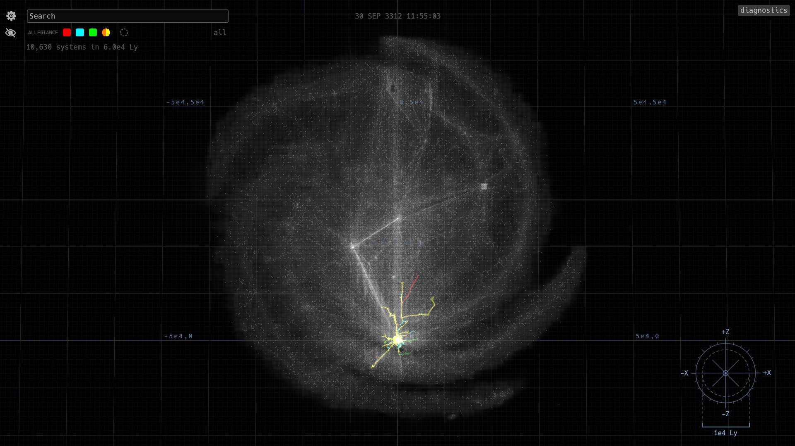
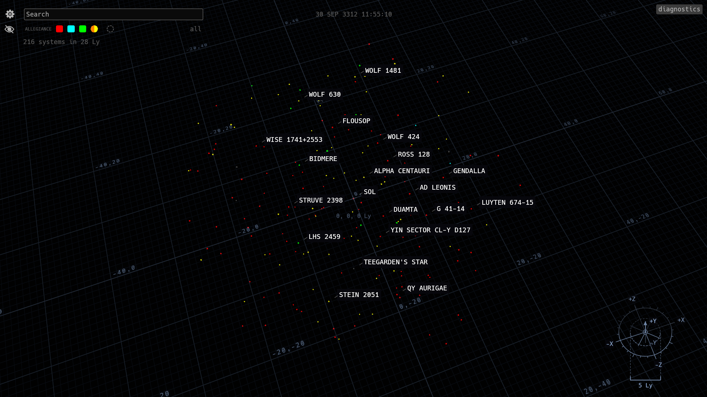
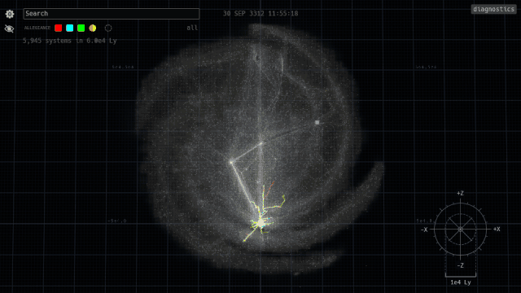

# Galos Map




The map is pointed at one directory, and reads no database of its own.
`--index DIR` is the index `galos ingest -i DIR` writes, and
`GALOS_INDEX` says the same thing for a machine that always draws the same
one; with neither, the map reads `.galos_index` under wherever it was run
from. A commander's own journal reaches the map the same way everything
else does: `galos ingest --from journal=DIR --index DIR` writes it into the
index the map reads.

```sh
cargo run --release
# The index somewhere other than beside the working directory.
cargo run --release -- --index "$HOME/.galos_index"
GALOS_INDEX="$HOME/.galos_index" cargo run --release
```

## How it draws

The **far field** is everything outside the system the camera stands in: one
spatial hierarchy over every system and everything reading it — the map's
level of detail, the night sky's discrete stars, and the glow behind both. It
is built and read by [`galos_index`](../galos_index), which is also the
client's on-disk format, and that is what lets the map draw the galaxy
without a database.

The **near field** — a system's own stars and planets at real geometry, and
reaching them — is the code under
[`src/map/bodies`](./src/map/bodies).

What it draws is a moment rather than a pile of scans. A system's rows arrive
from as many commanders as have ever flown there, so each orbit carries how
long before that moment it was read and is run on from its own reading. So a
planet is drawn where the game has carried it by now rather than where
somebody once saw it.

The moment is the galaxy's, not a system's: one now, the same on both sides
of a flight, and each system answers it from its own newest scan. It is read
in a strip of its own, at the top of the viewport and in the middle of it, in
the game's own calendar — which runs 1286 years ahead of ours and otherwise
with it: `16 DEC 3300 13:45:00`, whether or not the camera is inside a system.

Clicking that reading opens a slider under it, and dragging one runs the map
on past the present; the span it stands at is named beside the date, with a
`Now` to let go of it. The slider covers one turn of whatever it is geared
to, and `Body` and `System` beside the reading are which: one orbit of the
body picked out, laid evenly, or one turn of the widest orbit the system has,
laid by decades — a system's slowest body takes a median 993 times as long to
come round as its fastest, so there is no one span that suits a whole system,
and which of the two is wanted is not something the map can work out from
what was clicked. The switch stands only where both turns are on record. Its
places are marked underneath in the spans a reader thinks in, `now` at the
near end and how long the turn runs at the far one, since a logarithmic rail
says nothing for itself about where along it a day is. The phase slider under
a body's panel is the same control geared to that body alone, and the camera
keeps a body picked out under itself while the moment moves.

The strip is turned off in the settings pane, under General with the names
and the grid. Hiding it puts the map back to the present: the reading is the
only place a run-on is shown and the only way back from one.

The two meet in two places only: the sizing law's context scalar in
[`src/map/paint/sizing.rs`](./src/map/paint/sizing.rs), and the photometric scale
the local star is lit by.

Everything reaches the screen flat. A single float resolves one part in
sixteen million of whatever it holds, and a star sits `1e17` metres out, so a
mark or a name built as a mesh where its system actually is tears apart in
the `f32` clip transform. So every mark and every note — the star field, the
names and their leaders, the rings around what is pointed at and picked out,
and the ruled plane's readouts — is projected to a pixel on the processor in
`f64` and painted flat with egui. The star field is
[`src/map/paint/field.rs`](./src/map/paint/field.rs), the names and leaders
[`src/map/labels.rs`](./src/map/labels.rs), the projection they all share
[`src/map/screen.rs`](./src/map/screen.rs), and the cameras and the
order they draw in [`src/map/camera.rs`](./src/map/camera.rs).

The map view's marks and the glow behind them are one light: a system is
worth the same whether it is drawn as its own mark or the glow stands in for
it, and the glow is linear, a crowd worth the sum of its systems wherever it
stands, so two star classes of the same count lay the same light. That runs
over some thirty stops in one frame, so the glow is drawn into a target of
its own and brought onto the display a pixel at a time through one curve
([`src/map/paint/curve.rs`](./src/map/paint/curve.rs)), read in stops over
an average system's mark along the axis drawn, held down as the reach
widens and, inside two thousand light years, as it narrows too: close in
the marks are the picture and the glow is a backdrop. Each mark goes
through the same curve on its own, at a set exposure, and is laid over the
glow, so a system drawn as itself reads as one over the crowd behind it at
every zoom; along star class, close in, a star's mark comes on up to the
display's full brightness in its class's colour. The settings pane, under
the map view, sets
it: Glow takes the glow away and leaves the marks, and its Brightness lifts
or holds down the glow alone, in stops, the marks staying where they are;
Field Exposure slides the frame along the curve, and Field Curve is the
curve itself, seven points dragged up and down — past one another too, to a
peak or a trough — with a cubic through them that never overshoots one. The
exposure and the curve move the marks as well as the glow, with the glow on
or off. What the filters exclude is drawn into a second target and dimmed
after the curve, so the Filtered Opacity dims the glow as far as it dims a
mark.

Most of the galaxy stands in index cells 256 to 512 light years across, each
evenly filled, which the index can describe by nothing finer than a count.
Laid as a blob at each cell's middle they summed to a grid of lumps on the
cells' own pitch once those stood tens of pixels apart. A filled cell that
wide on screen is instead part of a volume
([`src/map/paint/volume.rs`](./src/map/paint/volume.rs)): the glow at any
point is the mean of the densities of the cells around it, each weighted by
a tent as wide as its cell, so it runs straight between neighbours and
holds flat across a change of cell size, and fades out over one cell past
the last. Each pixel marches its own ray through it, at half the frame's
resolution. A cell whose systems sit tighter than it — a filament, a
cluster — keeps its blob at its own centroid and its own spread, which is
where the detail is.

The galaxy is drawn the way round the game draws it. Its coordinates are
left handed — seen from galactic north with the core at the top, `+X` is on
the right — and the renderer is right handed, so the camera is mirrored
across its own x rather than any position being changed. Every coordinate the
map prints is the game's own. The mirror is `MIRROR` in
[`src/map/camera.rs`](./src/map/camera.rs), and the screen's axes are asked
of the camera there rather than worked out from its rotation.

A compass rose stands in the bottom right corner, turned with the camera. Its
card lies in the galactic plane, foreshortened the way the ruled plane under
the middle of the view is, and its four points are that plane's axes, `+X`
`-X` `+Z` `-Z`, the ones the grid's numbers count along. Coreward, rimward,
spinward and trailing are left alone: they are relative to where they are
said, and `+Z` is coreward only on Sol's side of the core. The rose's north
has left the card: it is the needle standing up out of it along `+Y`, and
seen end on the hub shows a dot where `+Y` comes at the eye and a cross
where it goes away.

A dashed ring on the card is as wide as the roundest length that fits across
it, and a scale bar under the rose spans exactly that width, with the length
written under it. The solid marks standing up at the bar's ends carry on up
to the ring as dashed lines, in the ring's own dash — in whatever
the grid is measured in, light years or light
seconds, whether or not the grid is shown. It has its own switch in the
settings pane, under General beside the grid's. The rose is
[`src/map/rose.rs`](./src/map/rose.rs).

Everything picked out is marked on the rose. The needle is as long as the
card is wide, so the rose is read as a sphere, drawn at the scale the dashed
ring says. Something near enough to lie inside that sphere is a circle where
it is, to scale, standing on the card by a line down or up to it, the way the
ship's scanner stands its contacts on its disc. Something further off is a
small head pointing in at the hub, its bearing from the middle of the view,
which says which way to turn for it: it lands where the way to the thing
meets the sphere — on the ring for something level with the view's middle,
at the needle's head for something straight above, and between for
everything between — and gets a bar behind it for each tenfold further off,
up to three. Each is painted in its star's color — the color key's hue on
the map, the star's own tint in the realistic view — so the marks tell apart
which is which.

The rose answers the pointer. Clicking a point turns the camera to face along
that axis and keeps its pitch. Clicking a mark turns the camera to look
straight at what it marks, which then stands in the middle of the screen,
and pulls the camera back until it is in view (never in); double-clicking a
mark flies there. Clicking `+Y` looks straight down onto the plane and `-Y`
straight up from under it. Clicking the hub looks straight down, and clicking
it again goes back to the pitch it was clicked from. Every turn eases, as a
drag does. Hovering over a piece of the rose says what it does in the line
under the scale bar. Over a mark, that line gives its name, how far off it
is, how far over or under the card, and its bearing clockwise from the core
(`+Z`). Over the hub, it gives where the view is centred. The view's centre
is no longer written at the middle of the view by default; "Show Center
Position" in the settings pane puts it back.

## The color key

The map is colored by allegiance, government, security, primary economy, the
controlling faction's state, the controlling power or the system's Powerplay
standing, and every color of every one of them is a toggle. The key at the
top of the bar's Filter tab lists them — the three powers and an Other that
folds away for allegiance; one group a color for government, economy and
state; each power under the allegiance it answers to, in that allegiance's
color; four values for security, anarchy being the absence of security; and
the Powerplay standings down the ladder of a hold, a firmer one bluer — with
how many colonies each counts, leaving out any value no colony holds, and its
dropdown is what chooses the coloring. Clicking a value hides the
systems drawn in it; alt, ctrl or command clicking one shows it alone.
Uninhabited systems have a row of their own. A system's panel names its state,
power and standing beside its politics.

Star class is the one coloring of every system rather than of the colonies:
each system in the color of the star a ship arrives at, the main sequence
hot to cool — O and B cyan, A and F blue, G yellow, K orange, M red, every
one of them a star a fuel scoop can use — then what cannot be scooped,
remnants magenta and the rest green, and nothing on record gray. The main
sequence also dims hot to cool, each class a step darker than the one before
it, map and key alike: the colors keep their hue and are drawn brighter or
dimmer, since yellow on its own would outshine them all. A scanned star is
drawn as a colony with no politics on record is on the other colorings, a
quarter of a mark in its color times its class's step, and an unscanned one
as the empty sky is, faint and neutral and held down so the three fifths of
the galaxy nobody has scanned cannot bury the rest. Its marks are a sample of
the systems rather than the brightest of them: each cell spends its marks on
every class in the proportion it holds, brightest first within each, so a
cell of brown dwarfs draws brown dwarfs where the other colorings would draw
its few bright stars. That reads each drawing cell whole, as a filter does,
while its share is big enough to sample, and from its brightest part beyond.
It has no Uninhabited row, and is not offered while scaling with population,
which draws the colonies alone and knows none of their stars. The far field
reads it off each cell's count of its stars by kind, which an index written
before that count arrived gains with `galos index migrate`.

Every coloring hiding something is filtered, not only the one on screen:
hide High security, color by state and hide Expansion, and the map is the
systems that are neither. Values of one coloring are either, High or Medium
security, and colorings are both, that security and that state. A coloring
that is not on screen says so in a row of its own under the color row, with
the same swatches and `x`, so nothing is hidden with nothing to say why.
Uninhabited belongs to the color row and applies along whichever political
coloring is out; another coloring's row leaves empty systems alone, since
they have no security or state to hide. It narrows whatever the filters pick
out, and is drawn the way they are, at the Filtered Opacity setting, or not
loaded at all at zero. Far off, a merged mark or the field knows each
coloring's counts but not how they overlap, so it takes them as independent
and is drawn at the product of their shares, which comes to the same
whichever coloring is on screen.

With the form shut the key folds into the color row, the first row under the
bar: a swatch a value to click, and a count of what is hidden with an `x`
to show it all again. Hovering it names the colors; a click anywhere on it
but a swatch or the `x` opens the whole key. Another coloring's row works the
same way, and a click on it colors the map by it and opens its key. While
scaling with population only colonies are drawn, so Uninhabited leaves the
key until it is off, and a star class row says it is not applied in that
view, the colonies carrying no star. The realistic view colors stars by
their own light, so it shows no color row and keeps Uninhabited for the map
view; every other coloring hiding something still applies, each with its row.
`I`, or the eye under the gear, puts the interface away and leaves the rose
and the key, in the top left, standing over the map, with a line under it for
each other coloring hiding something, saying what it hides. The key is
[`src/map/filter/key.rs`](./src/map/filter/key.rs) and the mask it sets
[`src/map/filter/mask.rs`](./src/map/filter/mask.rs).

## Mouse

| Gesture | What it does |
|---|---|
| Left drag | Swing the camera around what it looks at |
| Right drag | Pan the map across the view |
| Wheel | Zoom in and out |
| Click | Pick out the system or body under the pointer |
| Ctrl, command or shift click | Pick one out alongside the rest, or let go of it |
| Click on empty sky | Let go of everything picked out, and put away what the chrome has open |
| Double click | Fly to what was clicked |
| Click the date at the top | Show or hide the slider that sets the moment |

The bar's rows read the same way as the sky they name. A double click on the
row for a selected system flies to it, as a double click on its star does, and
a double click on a filter's row frames everything that filter admits. A single
click on a row says which of several is the one being worked with, and asks
nothing on a row about something already picked out.

A drag belongs to whatever the press landed on for as long as it lasts, so one
started on a slider goes on talking to the slider wherever the pointer wanders.

The bar's form and the clock's scrubber are put away the same way, being the
same kind of thing: whatever opened them again, a click on empty sky, and the
escape key. The last two mean all of them — an escape over an open form and an
open rail takes both, rather than asking to be pressed twice.

## Keys

| Key | What it does |
|---|---|
| `W` `A` `S` `D` | Pan along the ruled plane, rather than across the view |
| `Q` `E` | Pan down and up through it |
| `Z` `X` | Swing the camera left and right around what it looks at |
| `C` `V` | Lower and raise it over the plane |
| `F` `R` | Zoom in and out |
| `Space` | Fly to what is picked out, one at a time |
| `H` | Go home: Sol, from where the map opened |
| `L` | Show or hide the labels |
| `O` | Show or hide the orbit lines |
| `G` | Show or hide the grid |
| `I` | Hide or show the interface, leaving the rose and color key |
| `U` | Show or hide the settings |
| `K` | Show or hide the color key over the hidden interface |
| `N` | Show or hide the compass rose |
| `T` | Show or hide the clock |
| `/` or `Shift-S` | Search the box for a system |
| `Shift-F` | Ask the box for a faction to filter on |
| `Shift-R` | Ask the box for systems to route between |
| `Esc` | Put away the bindings, or everything the chrome has open |
| `F1` or `?` | Show or hide these bindings |
| `F3` | Show or hide the diagnostics window |

Panning and zooming cover ground in proportion to how far out the camera is, so
a key moves the map at about the same rate whether it is looking at the whole
galaxy or at one planet.

Every binding is a key struck on its own, but for the four that want shift: the
three that put a question in the bar's box, and the `?` that opens the key
list. Held with control, command or alt, a key is left alone. So is every one
of them while a field is being typed into, apart from the escape that puts the
field away.

An escape puts away whatever the chrome has open, all of it at once. The
bindings window is the exception and goes first, being read over everything —
a form left standing while something is looked up included.

The map is quit by closing its window.

## Profiling

`--features tracy` builds the map to be profiled and
[Tracy](https://github.com/wolfpld/tracy) reads it: bevy's own zones — one per
system, per schedule and per render pass, and a frame mark per present — plus
the map's, which are the work that happens off the main thread and would
otherwise be unexplained gaps on the pool threads: `index read` (opening),
`refresh poll`, `cell payloads` (one per batch of cells a worker reads, named
with how many), `build batch` (the systems a frame spawns, named and
coloured on the pool), `region cells` (one per worker of the legacy region fetch, named
with its share), `route search`, `name search`, `stop lookup` and `bodies
read`. Those are compiled into every build and go wherever the subscriber
sends them, which without the feature is nowhere.

The protocol is versioned and checked when the profiler connects, so the
profiler has to be the release the client speaks: **Tracy 0.13.1**, which is
the `tracy-client-sys` 0.28 in `Cargo.lock`. `brew install tracy`, or a build
of that tag.

```sh
cargo run --release --features tracy -- --index "$HOME/.galos_index"
# In another shell: the profiler to watch it live, or a capture to read after.
tracy
tracy-capture -o galos.tracy -s 20
# Every allocation as well, attributed to the zone that made it.
cargo run --release --features tracy_memory
```

The map first, then the profiler. Until something connects the client holds
everything it is told, which is what bevy warns about on startup — memory
grows until it is read — and a profiler already listening when the map starts
can lose the handshake and exit rather than wait through it.

### Scripted

`profile.sh` does the above with nobody at the window: it builds with
`--features tracy`, flies each scenario through the shot driver
(`src/dev/shot.rs`) — standing still, zooming out, zooming in, panning,
turning, hiding a color from the key while standing still, and the galaxy
seen whole standing still (`galaxy`) and panning (`galaxypan`) — captures
each with `tracy-capture`, and reads the traces back with `tracy-csvexport`
and `awk`. For each it prints the frame times and
what the slowest tenth of frames spent, by zone. Traces stay in `-o` to be
read again or compared.

```sh
galos_map/profile.sh                              # every scenario, 360 frames
galos_map/profile.sh -f 240 -z build_glow out pan
galos_map/profile.sh -o /tmp/before && ...        # change something
galos_map/profile.sh -o /tmp/after
galos_map/profile.sh -c /tmp/before /tmp/after    # the two, scenario by scenario
galos_map/profile.sh -r out                       # read what -o holds, fly nothing
```

What to know before reading one:

- A frame is the time between two runs of the shot driver, loading
  included. Bevy runs systems on whichever thread is free, so zones are not
  told apart by thread: the map's own background tasks (`cell payloads`,
  `build batch`, ...) are reported apart, summed over the threads they ran
  on, and hold a frame up only through what waits on them.
- Zones nest, so a zone's time includes the zones inside it.
- Read a still view's numbers from its end, not its mean: the first seconds
  are the view loading.
- Reading a trace takes some fifteen seconds: macOS's `awk` is slow over a
  million events.
- A map left over from an earlier run holds Tracy's port, and the capture
  never connects to the next one; the script kills any before it flies.
- With the display asleep the frames still run and the trace is good, but
  the screenshots the driver takes come out black.

`RUST_LOG` replaces bevy's filter whole, and a filter that drops a span drops
it from the capture as well as from the log, so a run with `RUST_LOG=warn`
profiles nothing. Leave it unset, or keep `info` in whatever it says.

A release build is the one to read. The dev profile is `opt-level = 1` with
its dependencies at 3, which is playable but is not what the numbers mean.

## The pictures above

`media.sh` makes all three, through the same shot driver `profile.sh`
flies, all seen from galactic north: `galaxy.png` is the whole galaxy from
above, `local.png` the stars within a few tens of light years of Sol with
their names, and `demo.gif` a flight from the galaxy down into the Sol
system, ending on the planets out to Mars, with the names coming on inside
8 light years. The flight is recorded a frame at a time and put together by
ffmpeg, which has to be on the path. The camera and the window's size are
the script's, so a run on any display comes out the same size; what is
drawn is whatever the index holds, `.index/full` unless `-i` names another.

```sh
galos_map/media.sh                     # all three, written beside the script
galos_map/media.sh demo                # the animation alone
galos_map/media.sh -o /tmp galaxy      # somewhere else, to compare first
```

The map opens a window for each and closes it when done. It is a capture of
the screen, so the display has to be awake: asleep, the frames come out
black. On macOS the script wakes it and holds it awake with `caffeinate`.
