# Color key and filter redesign

The design for merging "Color By" and the bar's Filter tab into one color key,
where every color of every category is a toggle that hides the systems drawn
in it. [`SPEC.md`](./SPEC.md) is the written spec. The mockups below are
treated as authoritative alongside it: where the two disagree, ask.

`mockups/` holds each artboard rendered to PNG. `source/` holds the canvas the
artboards were drawn in (`.dc.html`, one per artboard, with `canvas.json` as
its index), which renders only inside the Design canvas runtime; the PNGs are
what to read.

## Elements

| | |
|---|---|
| Allegiance key: Other collapsed, and expanded with Independent hidden | 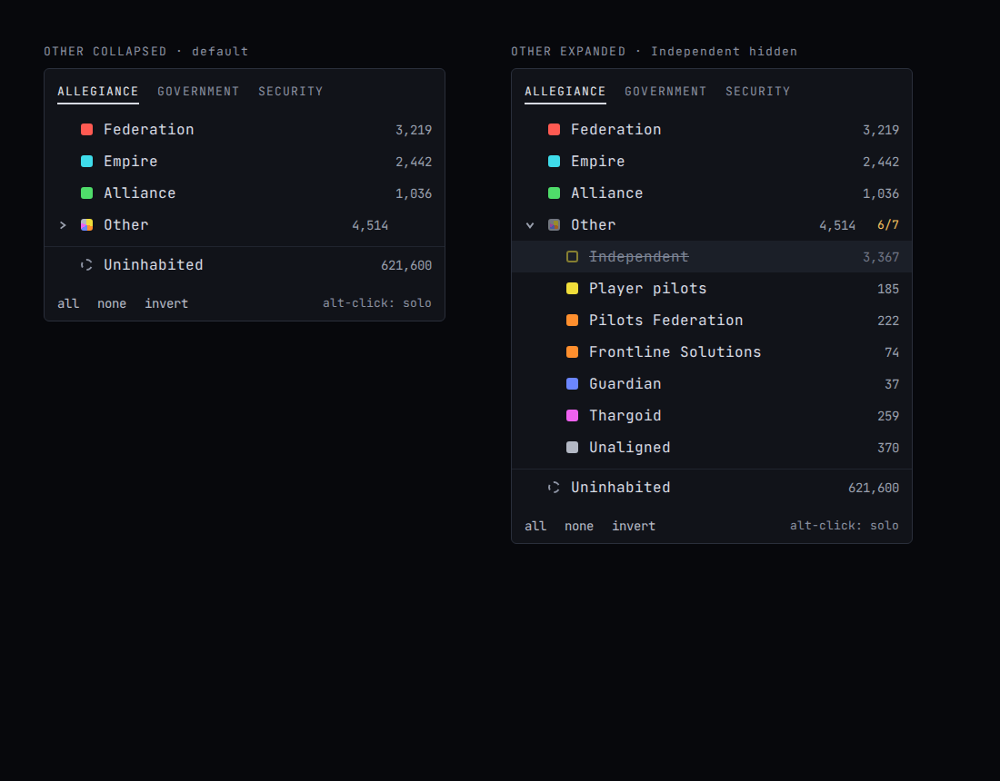 |
| Government key: one group per hue | 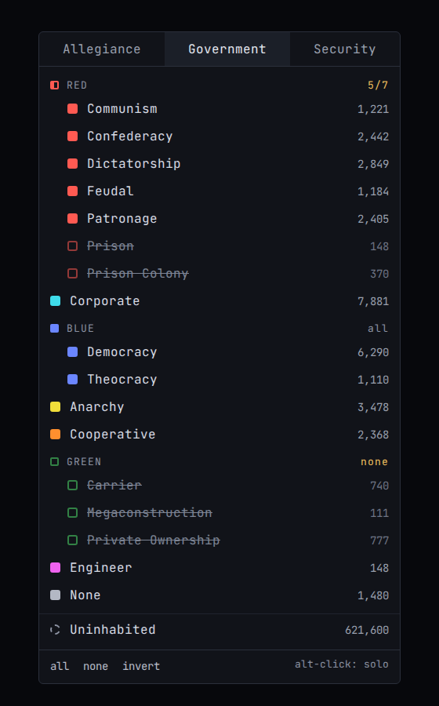 |
| The whole Filter tab: key, footer, faction lookup, recency | 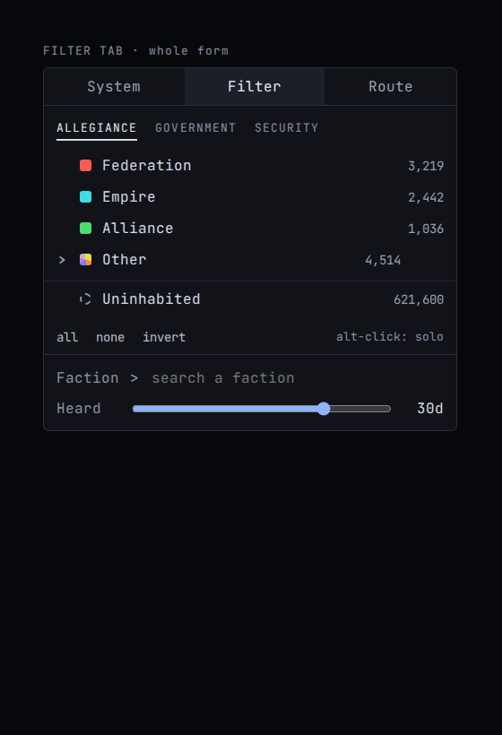 |
| Color row: all shown, Other hidden, Federation solo, mask lifted | 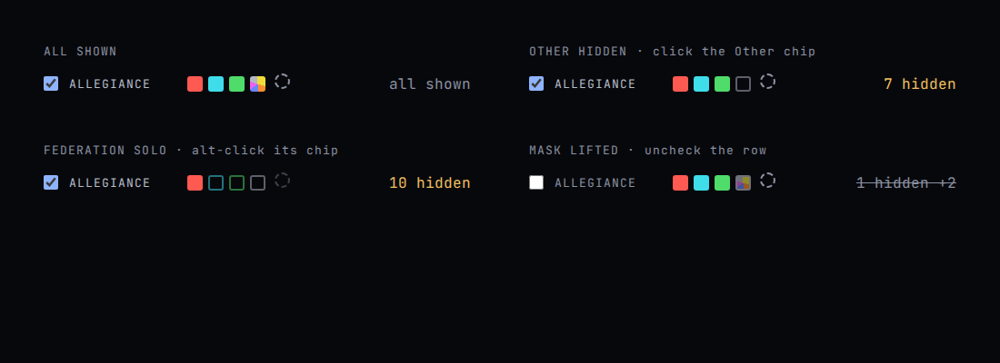 |
| Mini legend: popover on hover, and bare above the rose | 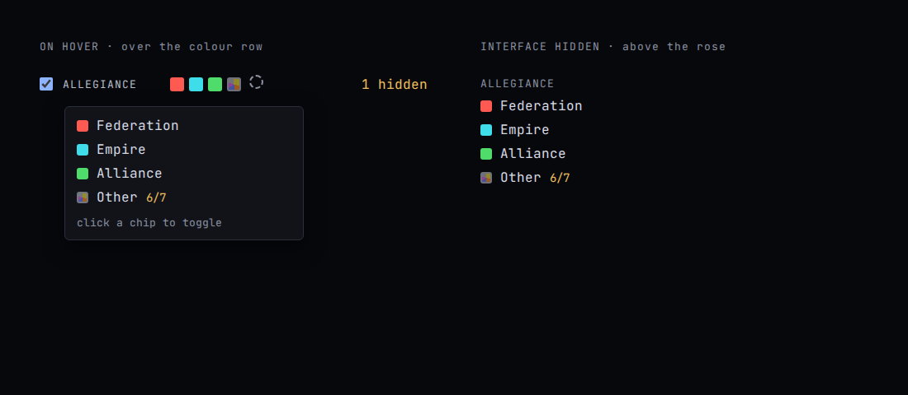 |

## Full view

The interactive board, at its default state (the map idle, the color row
under the bar).

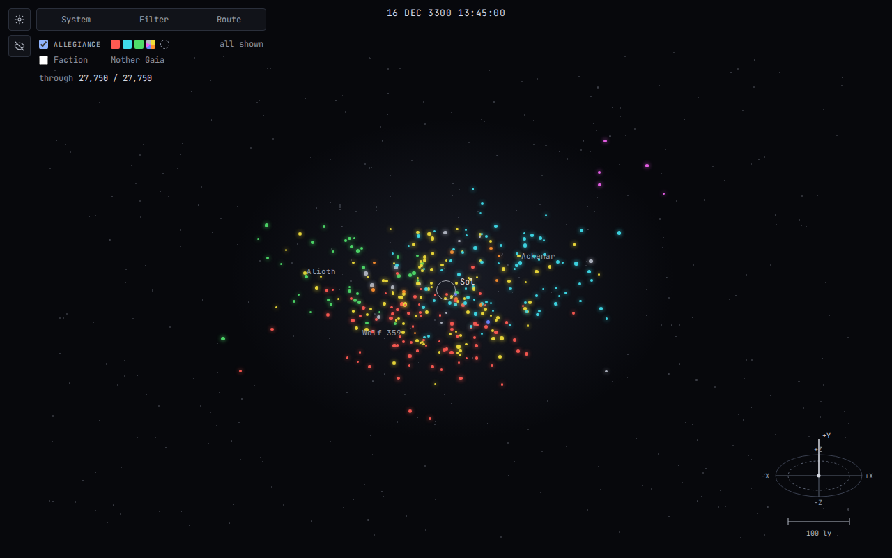

## Flows

**A · Glance**

1. Idle map, color row under the bar 
2. Hover the row: the mini legend names the chips 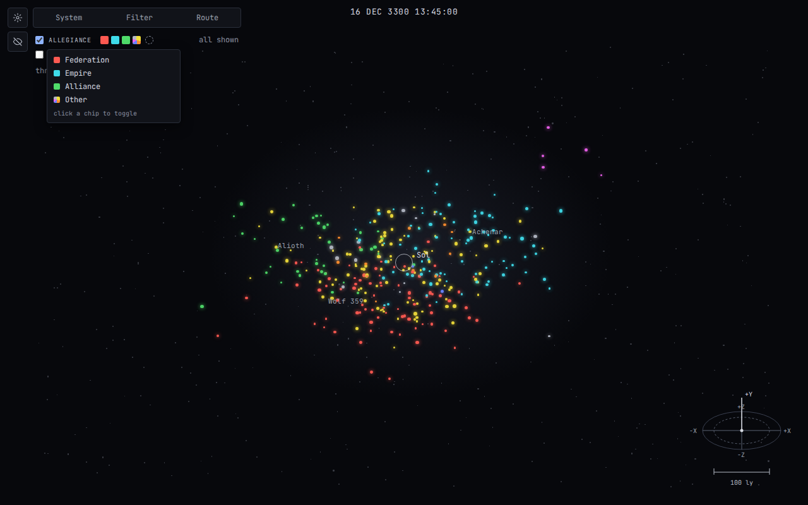

**B · Quick toggle**

1. Click the Other chip: all 7 hidden 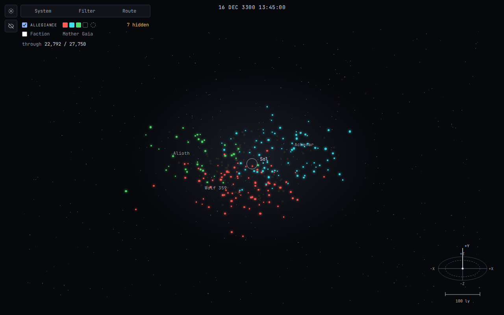
2. Alt-click Federation: solo 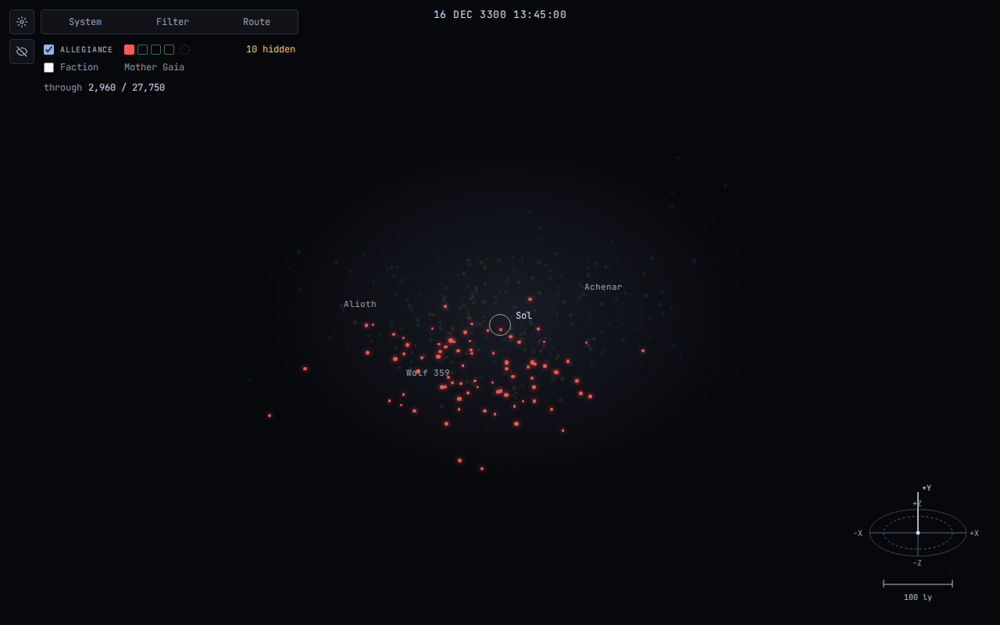

**C · Full edit**

1. Click ALLEGIANCE: the Filter tab opens on the key 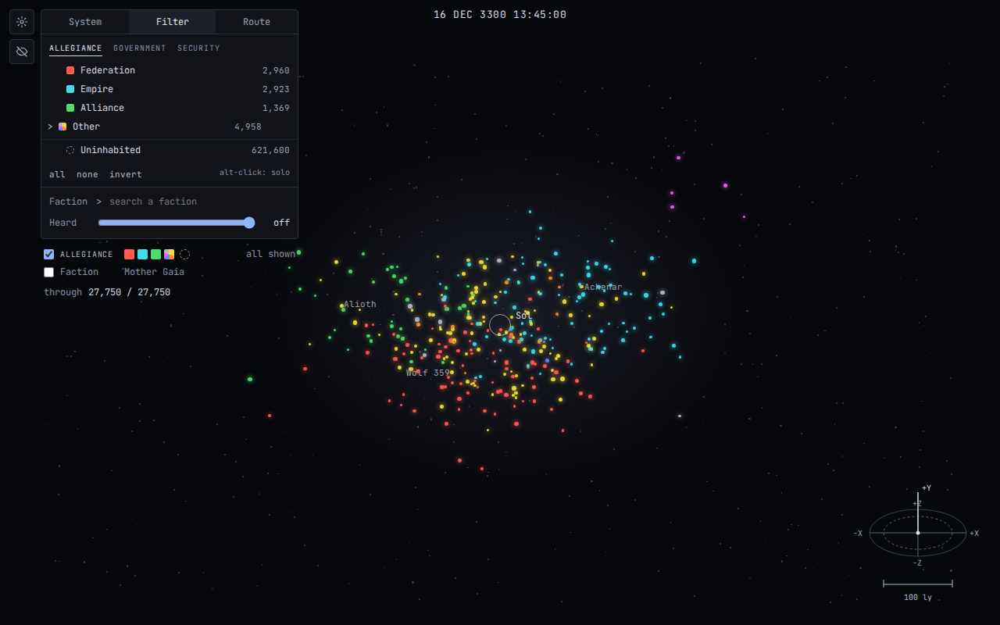
2. Expand Other, hide Independent 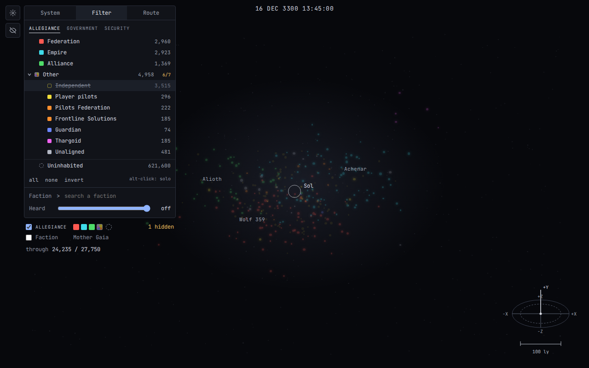
3. Switch to GOVERNMENT, hide Prison and Prison Colony 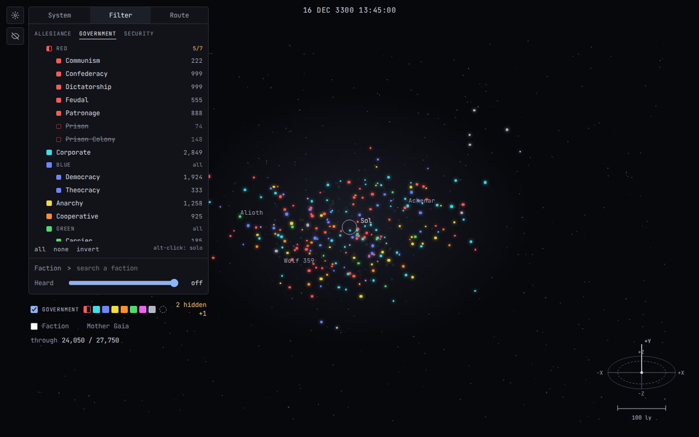
4. Close the form: the row reads `2 hidden` (the mockup's `+1` is from the first
   draft, where other categories also applied) 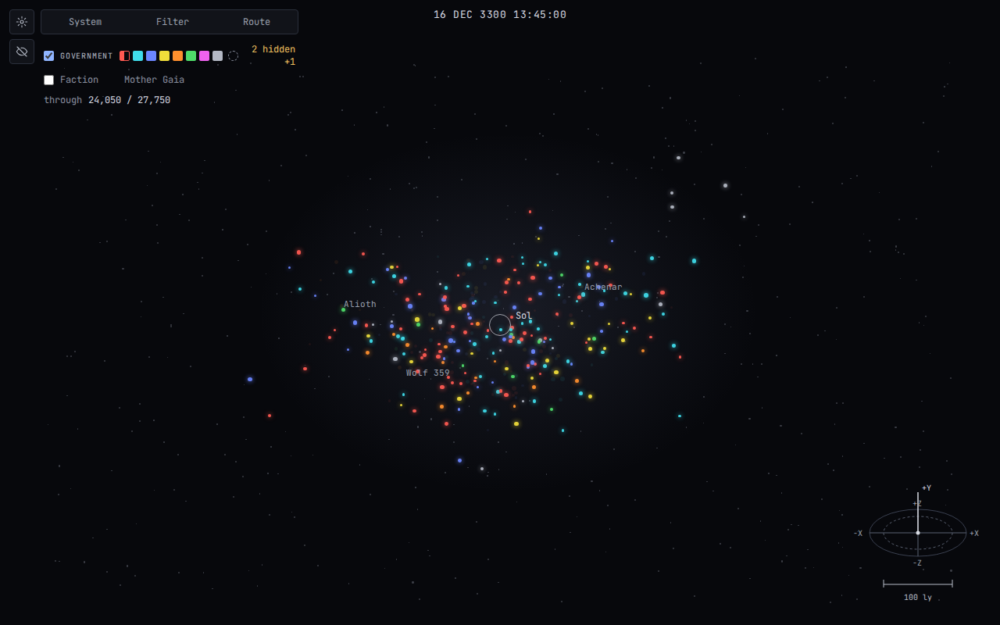

**D · Lift the mask**

1. Uncheck the row: everything comes back, the summary is struck
   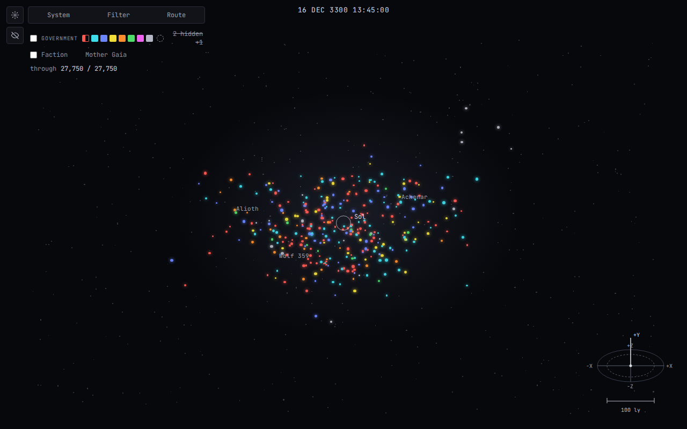

**E · Interface hidden**

1. The mini legend stands above the rose 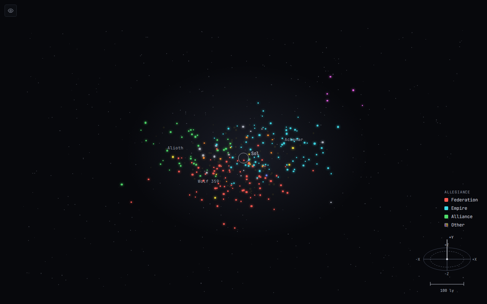
